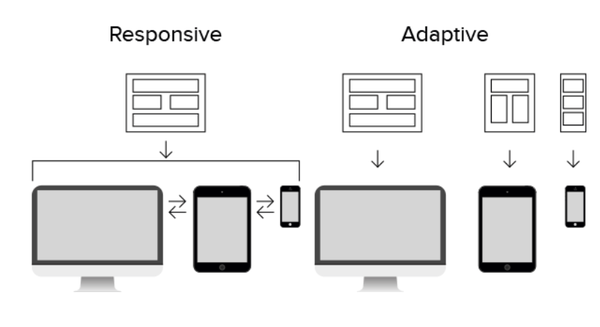
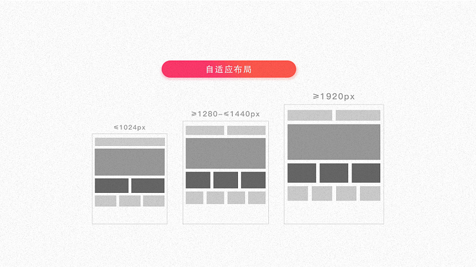
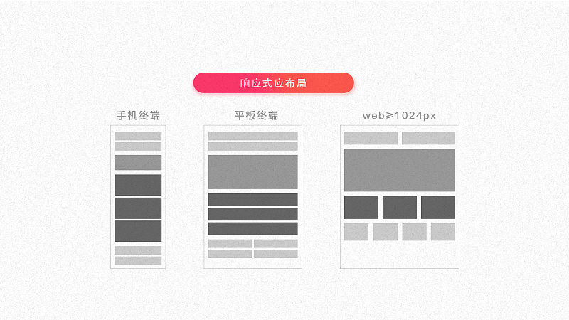

# 1. 响应式设计定义
针正对任意设计对网页内容进行完美布局的一种显示机制。响应式网页设计就是一个网站能够兼容多个终端。 
- 如果需要根据不同设备提供特定的内容和功能，则需要一个真正的`手机版`网址，此时手机网站会提供与桌面版网址完全不同的用户体验。
- 进入响应式设计的教堂，不需要再迷恋`px`这个度量单位。而是使用相对度量单位`em`或者百分比。
# 2. 自适应与响应式布局的差别
容易搅浑自适应布局和响应式布局的差别。这里这张图能够展示出它们俩的区别. 
 
- 自适应的体验 
 
- 响应式的体验 
 
# 3. 响应式技术实现
- 媒介查询
媒体查询可以让你根据在特定环境下查询到的各种属性值——比如设备类型、分辨率、屏幕物理尺寸及色彩等——来决定应用什么样的样式。通过使用媒介查询，可以获取到设备及设备的特性，及时的响应布局方案，从而解决之前在单纯的布局设计中遗留的问题。
- 流体布局
原特指以百分比为度量单位的布局技术实现方式。在响应式设计的布局中，不再以像素（px）作为唯一单位，而是采用百分比或者混合百分比、像素为单位，设计出更具灵活性的布局方式。
- 弹性图片
伴随布局的弹性，图片作为信息重要的形式之一也必须有更灵活的方式去适应布局的变化。扩大研究范围：除了图片，还应该包括图标、图表、视频等信息内容的响应方式。