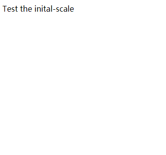
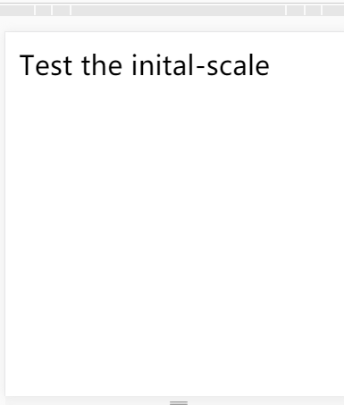

# 1. 基本语法
通常情况下，媒体查询最长用的设备是`视口宽度(width)` 和`屏幕宽度(device-width)`。下面对这些特性进行列举。
- 使用频率最高为前4个
- 除了scan 和grid，都可以使用min,max作为前缀表示查询范围。<br>


| 属性 | 备注 | 
| :--- | :-------- | 
| width | 视口宽度 |
| height | 视口高度 |
| device-width | 屏幕宽度 |
| device-heigth | 屏幕高度 |
| orientation | 设备处于横向还是纵向(portrait:纵向) |
| aspect-ratio | 基于视口宽度和高度的宽高比,等价于 `width / heigth` |
| device-aspect-ratio | 基于屏幕款高度的宽高比 |
| color | 检测颜色的位数,例如min-color: 检测设备是否拥有 16 位颜色 |
| color-index | 设备颜色索引表中的颜色数，必须是非负数 |
| monochrome | 检测单色帧缓冲区中每像素所使用的位数。非负数，`monochrome: 2` |
| resolution | 用来检测屏幕或打印机的分辨率。`min-resolution: 300dpi`。可以接受每厘米像素点数的度量值:`min-resolution: 118dpcm` |
| scan | 电视机的扫描方式: `scan: progressive`。 progressive(逐行扫描)或interlace(各行扫描)
| grid | 检测输出设备是网格设备还是位图设备 |
## 1.1 通过html页面的link设置
可以通过link设置媒体查询规则，在html页面的头部中，引入css的时候，进行媒体规则设置。
- 媒体查询之间使用逗号分隔，满足一个条件则可加载css
- 同一个规则的不同条件可以使用and连接
```html
<!-- 媒体查询设置为screen 或者projection， 能够加载该css文件-->
<link rel="stylesheet" type="text/css" media="screen, projection" href="screen.css"/>
<!-- 媒体查询为screen，并且是纵向的显示屏 -->
<link rel="stylesheet" type="text/css" media="screen and (orientation: portrait)" href="screen.css"/>
<!-- 前面有一个not，表示媒体查询为：非纵向放置的显示屏设备 -->
<link rel="stylesheet" type="text/css" media="not screen and (orientation: portrait)" href="screen.css"/>
<!-- 表示：视口宽度大于800像素的纵向显示屏设备，才能加载该css文件 -->
<link rel="stylesheet" type="text/css" media="screen and (orientation: portrait) and (min-width: 800px)" href="screen.css"/>

```
## 1.2 通过css设计媒体查询的语法
也可以直接在css中设置媒体规则，对应上面的规则编写一个css版本的。
```css
@media screen {

}
@media screen and (orientation: portrait) {

}
@media screen and (orientation: portrait) and (min-width: 800px) {

}
```
也可以通过css的@import指令在当前演示表中按条件引入其他样式表。例如下面的代码会给视口最大宽度为360像素的显示屏加载一个phone.css的样式表。
- 注意：使用@import会增加HTTP请求，影响加载速度，因此谨慎使用该方法。
```css
@import url('phone.css') screen and (max-width: 360px);
```
# 2 阻止移动浏览器自动调整页面大小
IOS和android浏览器都是基于webkit核心，这两种浏览器和其他很多浏览器(如Opera Mobile)都支持用`viewport meta`元素覆盖默认的画布缩放设置。只要再`meta`标签中，设置了具体的宽度或者缩放比例，则页面的大小就会改变。
```html
<!doctype html>
<html lang="en">
<head>
    <title>JavaScript Patterns</title>
    <meta charset="utf-8">
	<meta name="viewport" content="initial-scale=2,width=device-width">
</head>
<body>
	<div>Test the inital-scale</div>
</body>
</html>
```
左边的图是浏览器，右边的图是移动端浏览器模拟,大小扩大了2倍。<br>
   <br>
当不设置initial-scale属性的时候，移动端会自动缩放，在PC端看起来正常的页面，在移动端也会正常地全屏显示，但是字体大小就像将大象缩放为了蚂蚁，看不清楚，解决这个问题就是将initial-scale设置为1。大小会与PC版本一致，只不过不能全屏显示，需要使用滚动条拖动。
```html
<meta name="viewport" content="initial-scale=1,width=device-width">
```
下面的代码允许用户将页面最多放大至设备宽度的 3 倍，最小压缩至设备宽度的一半。
```html
<meta name="viewport" content="width=device-width, maximum-scale=3, minimum-scale=0.5" />
```
也可以禁止缩放，不过缩放是一个重要的辅助功能，所以在实践中很少禁用 
```html
<meta name="viewport" content="initial-scale=1.0, user-scalable=no" />
```
# 3 媒体查询实例
```html
<!DOCTYPE html>
<html>
<head>
    <meta charset="utf-8" />
    <meta http-equiv="X-UA-Compatible" content="IE=edge">
    <title>Page Title</title>
    <meta name="viewport" content="width=device-width, initial-scale=1">
    <style type="text/css">
        ul {
            list-style: none;
            margin: 0;
            padding: 0;
        }
        @media screen and (min-width: 640px){
            ul > li {
                display: inline-block;
                border: none;
                border-left: 1px solid grey;
                padding: 0 10px;
                color: red;
            }
        }
        @media screen and (max-width: 640px){
            ul > li {
                display: block;
                border: 1px solid #fff;
                padding: 0 10px;
                color: brown;
                background: #f4efef;
            }
        }
    </style>
</head>
<body>
    <ul>
        <li>About</li>
        <li>Product</li>
        <li>Team</li>
        <li>Contacts</li>
        <li>Sitemap</li>
    </ul>
    <div>lorem ipsum dolor sit amet, consectetur adipisicing elit. A, esse, error ab natus facilis doloer sit ducimus unde maiores aperiam nam qu at ducimus placeat nisi maxilme perferedid df</div>
</body>
</html>