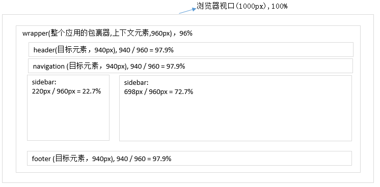
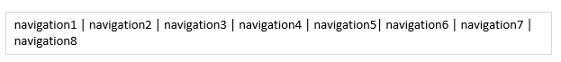

# 1. 百分比布局
使用媒体查询方式，我们都是在已知屏幕的情况下，为不同的屏幕尺寸编写不一样的样式。但当一个新的尺寸的屏幕出现，有需要编写一个新的尺寸的样式。当未来出现很多大小不同的视口出现，那么我们将疲于奔命地编写重复的内容。前面媒体查询缺点：
- 不能适应未知设备。
- 当样式1 切换到 样式2，不能有一个平滑过渡，直接切换。<br>
我们将固定像素布局转换成灵活的百分比布局，能让页面元素根据视口大小在一个又一个媒体查询之间灵活伸缩修正样式。将媒体查询和百分比结合起来，可以创造真正完美的设计<br>
- 使用百分比布局创建流动的弹性界面
- 使用媒体查询限制元素的变动范围
# 2. 将网页从固定布局修改为百分比布局
我们通常是会用PS来制作设计，在转化为网页的时候，我们通常会在原设计文件中点击文字对象，查看到具体的尺寸(通常为px)，然后编写到我们的css中，那么如何转换固定尺寸到相对尺寸呢？
```javascript
目标元素的宽度 / 上下文元素宽度 = 百分比宽度
```
这里，我们以一个宽度为1000px的设计图为准，将其转换为百分比宽度。<br>
- 对于wrapper来说，它的上下文元素是视口1000px
- 对于sidebar,navigation,content，header来说，它们的上下文元素是wrapper<br>
<br>
从上面来看，看似已经解决了不管是什么时候，只要通过百分比处理，那么应该都能适应。但是如果当尺寸比较小的时候，那么会出现如下的类似情况，导航宽度不够自动换行了<br>
<br>

# 3. 使用em 替换px
em的实际大小是相对于其上下文的字体而言。如果我们给body标签设置字体大小为100%，给其他文字设置相对单位em,则这些文字都会收到body的初始声明的影响。好处是：假如当所有文字都已经排版的情况下，需要将页面文字统一放大一点，只需要修改body的文字大小。
- 所有浏览器的默认line-height值都为1， 除了IE8之外，所有浏览器的默认font-size值都为16px IE8的默认font-size为12pt
- 在桌面端的Chrome/Opera存在最小字体限制，最小字体为12px，即如果设置的字体小于12px，那么浏览器自作主张地把字体给你设置为12px。 除了这两款浏览器外，其他所有浏览器都不存在字体最小限制！
```css
/* 一开始给body标签添加下面任意一条规则都是一样的效果 */
font-size: 16px;
font-size: 100%;
font-size: 1em;
```
# 4. 弹性图片
在现代浏览器（包括 IE 7+）中要实现图片随着流动布局相应缩放非常简单。只需在 CSS中作如下声明：
```css
img {
    max-width: 100%;
}
/* 可以将同样的样式应用到其他多媒体标签上,这些多媒体元素都可以自动缩放了*/
img, object, video, embed {
    max-width: 100%;
}
```
这种方法需要的注意问题：
- 准备一张足够大的图片，以备大视口使用
- 无论视口多大，什么设备，都得下载超大图片(因为不知道的此次的视口到底是多大的)<br>
第一个问题其实很好解决，如果只提供一张图片，需要适应不同的尺寸大小的视口，那么我们最好将wrapper限制最大宽度。然后准备一张适用于最大宽度的图片，设置图片的max-width即可。<br>
第二个问题的三种解决方法：
- 创建一个新的（HTML）元素
- 创建新的图像格式
- 使用特定技术手段
## 4.1 响应式图片的方案一： 创建新元素（或属性）
该方法已经在使用了，不过在使用方式上存在一些争议。这些争议主要来自两方面：业界的web开发者和浏览器制造者。web开发者提议创建一个新的picture元素（类似HMTL5中的video这样的元素），该元素中包含其他的图片源：
```html
<!-- 其中的img元素是默认情况下显示的图片源，在其上面的两个source元素则是在特定媒体查询（media queries）条件下显示的图片 -->
<picture alt="image description">
  <source src="/path/to/medium-image.png" media="(min-width: 600px)">
  <source src="/path/to/large-image.png" media="(min-width: 800px)">
  
</picture>
```
## 4.2 响应式图片的方案二：创建新图像格式
这种方法更容易解释了，Christopher Schmitt 呼吁针对响应式图片创建一种新的图像格式。该新的格式包含了几种不同大小版本的图片。比如100k的文件里有75k的版本、20k的版本和5k版本的图像。<br>
从某种意义上讲就像.mp3格式那样，该种文件格式既存储了歌曲也存储了歌曲的meta信息。这里的图像版本信息就好比MP3的meta信息，然后依据既定的一组标准选择该里面最为合适设备的一个图片版本。<br>
这种解决方法的缺点是必须放弃一些可控性能。新文件格式会自行决定什么时候使用哪个版本的图片，只是当然对于不支持该种格式的浏览器也失去了后向兼容。<br>

## 4.3 响应式图片的方案三：其他技术
我们可以模仿Filament Group的做法，他们针对Boston Globe网站提供响应式图片的做法如下：
- Markup —默认是用img元素标签
- Javascript — 决定viewport的尺寸，将存储在cookie中的相关信息传给服务器，而后再改变img标签的src属性。.
- Server — 获取初始图片请求，读取cookie，如果不是移动终端设备则返回1x1大小的空白占位图。然后等待JS脚本将真正的图片填充进去。
例如：
Adaptive images 项目灵感来源于Filament Group重构Boston Globe网站的工作。不过它需要诸如Apache 2, PHP 5.x, 和 GD 库等的支持，好在这些工具都比较常用。该技术首先在cookie中保存屏幕分辨率，然后决定使用哪种合适的图片尺寸。如果JavaScript和cookie被禁用了，它就检测user agent字符串。如果发现“Mobile”字符，就发送最低分辨率（定义在$resolutions里）的图片给终端，否则就默认假设你使用大设备终端并发送高分辨率图像。
响应式图片：http://caibaojian.com/3-solutions-for-responsive-image.html

# 5 流式布局与媒体查询配合使用
```html
<!DOCTYPE html>
<html>
<head>
    <meta charset="utf-8" />
    <meta http-equiv="X-UA-Compatible" content="IE=edge">
    <title>Page Title</title>
    <meta name="viewport" content="width=device-width, initial-scale=1">
    <style type="text/css">
		body {
            /* 设置body的字体大小为默认地销 */
			font-size: 100%;
		}
        /* 宽度设置为96%，但是最宽不能超过1200px。 */
		.wrapper {
			width: 96%;
			max-width: 1200px;
			margin: 0 auto;
		}
        /* 宽度为22.7%，但是不能超过202px */
        .sidbar {
            list-style: none;
            margin: 0;
            padding: 0;
			width: 22.7%;
            max-width: 202px;
			display: inline-block;
        }
		.content {
			width: 72.7%;
			display: inline-block;
		}
        .sidbar > li {
            display: block;
            border: none;
            border-bottom: 1px solid grey;
            color: red;
        }
        @media screen and (min-width: 1050px) and (min-width: 1200px){
            .sidbar > li {
                /* 设置padding的大小为em的倍数 */
				padding: 0 1em;
                /* 设置字体的大小为em的倍数 */
                font-size: 1.4em;
            }
        }
        @media screen and (min-width: 700px) and (max-width: 1050px){
           .sidbar > li {
				padding: 0 0.8em;
				font-size: 1em;
			}
        }
        @media screen and (min-width: 400px) and (max-width: 700px){
           .sidbar > li {
				padding: 0 0.6em;
				font-size: 0.8em;
			}
        }
    </style>
</head>
<body>
    <div class="wrapper">
        <ul class="sidbar">
            <li>About</li>
            <li>Product</li>
            <li>Team</li>
            <li>Contacts</li>
            <li>Sitemap</li>
        </ul>
        <div class="content">lorem ipsum dolor sit amet, consectetur adipisicing elit. A, esse, error ab natus facilis doloer sit ducimus unde maiores aperiam nam qu at ducimus placeat nisi maxilme perferedid df
        </div>
    </div>
</body>
</html>
```