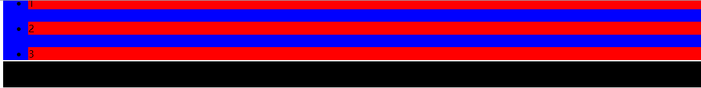

# 1.盒模型
盒子模型有两种，分别是 ie 盒子模型和标准 w3c 盒子模型。<br>
```javascript
标准（W3C）模型中：CSS中的宽（width） = 内容 （content）的宽
```
<br>
```javascript
CSS中的宽（width） = 内容（content）的宽+（border+padding）*2
```
<br>
结论：IE盒模型是陈旧知识点，除了帮助理解css3 box-sizing: border-box（等分宽度布局）外没什么用。不加文档声明的情况下，只有特别旧的低版本IE浏览器（测试IE8浏览器IE7-模式）才以IE盒子模型渲染，其他浏览都是标准模式。<br>
结论引用：http://www.cnblogs.com/wenhandi/p/7778757.html

# 2.auto使用
auto在盒模型中，只能用于：margin-left, with, margin-righ. margin-top , height,margin-bottom
## 2.1 水平：margin-left, with, margin-righ. 
- 全部设置为auto,一般默认为0
- margin-left,margin-right为auto, with为父容器宽度并居中
- with具体宽度，margin-left 具体宽度，margin-right为auto,这为auto的宽度为： 父容器with  - 元素with - 元素margin-left = 元素margin-right 

## 2.2 垂直： margin-top , height, margin-bottom
- 设置为auto,一般默认为0
- height:没有设置时，高度 = 内容的高度。

## 2.3 替换元素auto
img这种图片元素，当设置height or with 为auto时，会根据 heigth = 图片实际高度。

# 3.合并垂直外边距
当对li元素设置了margin-top, margin-bottom时，我们期望的是li元素之间相隔25px.但是实际为15px.取值为合并内容最大的那个值。
```javascript
//css
ul li{
    margin-top: 10px;
    margin-bottom: 15px;
}
//html
<ul>
  <li>1</li>
  <li>2</li>
  <li>3</li>
  <li>4</li>
  <li>5</li>
</ul>
```
## 3.1 负外边距
- 如果合并的外边距全为负值，取绝对值最大的
- 一正一负： 正数 - 负外边距绝对值
```javascript
// css: 两个负值：-18，-15取值-18.和正值相减：20-（|-18|） =2.最终只有2像素
ul li{
    margin-bottom: 20px;
    background: red;
}
ul {
    margin-top: -15px;
    background: blue;
}
h1 {
    margin-top: -18px;
    background: black;
}
//html
<ul>
  <li>1</li>
  <li>2</li>
  <li>3</li>
</ul>
<h1>dfdfdf</h1>
```
<br>