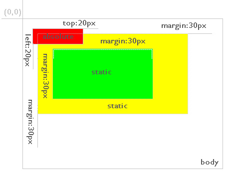

# 1. Position属性四个值：static、fixed、absolute和relative的区别和用法
position的四个属性值relative,absolute,static,fixed： 
- static（静态定位）：默认值。没有定位，元素出现在`正常`的流中（忽略 top, bottom, left, right 或者 z-index 声明）。
- relative（相对定位）：生成相对定位的元素，通过top,bottom,left,right的设置相对于`正常(原先本身)`进行定位。可通过z-index进行层次分级。　　
- absolute（绝对定位）：生成绝对定位的元素，相对于 static 定位以外的`第一个(有定位设置relative,fixed,absolute)父元素`进行定位,如果`父元素没有设置position,则是相对于body`进行定位。元素的位置通过 "left", "top", "right" 以及 "bottom" 属性进行规定。可通过z-index进行层次分级。
- fixed（固定定位）：生成绝对定位的元素，相对于浏览器窗口进行定位。元素的位置通过 "left", "top", "right" 以及 "bottom" 属性进行规定。可通过z-index进行层次分级。 

# 2. relative
定位为relative的元素`脱离正常的文本流`中，但其在文本流中的`位置依然存在`。 
他是默认参照父级的原始点为原始点，无父级则以文本流的顺序在上一个元素的底部为原始点，配合TRBL进行定位，当父级内有padding等CSS属性时，当前级的原始点则参照父级内容区的原始点进行定位。 
- 如果没有TRBL，以父级的左上角，在没有父级的时候，他是参照浏览器左上角(到这里和absolute第一条一样)，如果在没有父级元素的情况下，存在文本，则以文本的底部为原始点进行定位并将文字断开(和absolut不同)。
- 如果设定TRBL，并且父级没有设定position属性，仍旧以父级的左上角为原点进行定位(和absolut不同)。
- 如果设定TRBL，并且父级设定position属性(无论是absolute还是relative)，则以父级的左上角为原点进行定位，位置 由TRBL决定(前半段和absolute一样)。如果父级有Padding属性，那么就以内容区域的左上角为原点，进行定位(后半段和absolut不 同)。 
以上三点可以总结出:`无论父级存在不存在，无论有没有TRBL，均是以父级的左上角进行定位，但是父级的Padding属性会对其影响`。 

关于top,bottom,left,right的定义： 
- Top的值表示对象相对原位置向下偏移的距离, bottom的值表示对象相对原位置向上偏移的距离，两者同时存在时，只有Top起作用。
- left的值表示对象相对原位置向右偏移的距离, right的值表示对象相对原位置向左偏移的距离，两者同时存在时，只有left起作用。

 
黄色背景的层定位为relative，红色边框区域为其在正常流中的位置。在通过top、left对其定位后，从灰色背景层的位置可以看出其正常位置依然存在。 

# 3. absolute
定位为absolute的层`脱离正常文本流`，但与relative的区别是`其在正常流中的位置不再存在`。 
这个属性总是有人给出误导。说当position属性设为absolute后，总是按照浏览器窗口来进行定位的，这其实是`错误`的。实际上，这是fixed属性的特点。 

- 如果没有TRBL(top、right、bottom、left)，以父级的左上角，在没有父级的时候，他是参照浏览器左上角,如果在没有父级元素的情况下，存在文本，则以它前面的最后一个文字的右上角为原点进行定位但是不断开文字，覆盖于上方。
- 如果设定TRBL，并且父级没有设定position属性，那么当前的absolute则以浏览器左上角为原始点进行定位，位置将由TRBL决定。
- 如果设定TRBL，并且父级设定position属性(无论是absolute还是relative)，则以父级的左上角为原点进行定位，位置由 TRBL决定。即使父级有Padding属性，对其也不起作用，说简单点就是：它只坚持一点，就以父级左上角为原点进行定位，父级的padding对其根 本没有影响。  
以上三点可以总结出，若想把一个定位属性为absolute的元素定位于其父级元素内，只有满足两个条件： 
- 设定TRBL
- 父级设定Position属性 
初学者容易犯错的一点: 只要有一点不满足，元素就会以浏览器左上角为原点,当浏览器的大小改变，父级元素会随之改变，但是设 定Position属性为absolute的板块和父级元素的位置发生改变，错位了，这就是因为此时元素以浏览器的右上角为原点的原因。 
初学者容易犯错的一点: 不清楚Position属性为absolute的板块，若想定位到父级板块中，并且当浏览器的大小改变或显示器的分辨率改变，布局不发生改变，是需要满足两个条件的，只要有一点不满足，元素就会以浏览器左上角为原点，从而导致页面布局错位 

关于top,bottom,left,right的定义： 
- Top的值表示对象上边框与浏览器窗口顶部的距离，bottom的值表示对象下边框与浏览器窗口底部的距离，两者同时存在时，只有Top起作用；如果两者都未指定，则其顶端将与原文档流位置一致，即垂直保持位置不变。
- left的值表示对象左边框与浏览器窗口左边的距离，right的值表示对象右边框与浏览器窗口右边的距离，两者同时存在时，只有left起作用；如果两者都未指定，则其左边将与原文档流位置一致，即水平保持位置不变。  

在Position属性值为absolute的同时，如果有一级父对象（无论是父对象还是祖父对象，或者再高的辈分，一样）的Position属性值为Relative时，则上述的相对浏览器窗口定位将会变成相对父对象定位，这对精确定位是很有帮助的。

# 3. relative与absolute的主要区别
-  都脱离文档流，但是relative在原文档中的位置依然存在
- relative定位的层总是相对于其最近的父元素，无论其父元素是何种定位方式 

1. 黄色背景设置了position(不是static) 
relative: 
 
absolute: 
 

2. 父级都不设置position 
relative不会变，absolute会相对于body定位 
 

# 4。 什么是文档流？

- 将窗体自上而下分成一行行, 并在每行中按从左至右的顺序排放元素,即为文档流。
- 只有三种情况会使得元素脱离文档流，分别是：浮动，绝对定位和相对定位。

# 5. z-index属性

z-index，又称为对象的层叠顺序，它用一个整数来定义堆叠的层次，整数值越大，则被层叠在越上面，当然这是指同级元素间的堆叠，如果两个对象的此属 性具有同样的值，那么将依据它们在HTML文档中流的顺序层叠，写在后面的将会覆盖前面的。需要注意的是，父子关系是无法用z-index来设定上下关系 的，一定是子级在上父级在下。

Note：`使用static 定位或无position定位的元素z-index属性是无效的`。

 