```javascript
http://www.ruanyifeng.com/blog/2015/07/flex-grammar.html
```
# 1. 常见的网页布局
<br>

# 2. flex 是什么
Flex 是 Flexible Box的缩写，意为`弹性布局`。用来为盒装模型提供最大的灵活性。<br>
任何一个容器都可以指定Flex布局，行内元素也可以使用Flex布局。设置Flex之后，float,clear和vertical-align属性将失效<br>
```html
<style>
    .box {
        display: flex;
    }
    /* 行内元素 */
    .box-inline {
        display: inline-flex;
    }
    /* Webkit 内核的浏览器，必须加上-webkit前缀 */
    .box-chorme {
        display: -webkit-flex;
        display: flex;
    }
</style>
```  
# 3. 基本概念
采用Flex布局的元素，称为Flex容器(flex container),简称`容器`,它所有的子元素自动称为容器成员。陈伟Flex项目(flex item), 简称`项目`。<br>
容器默认两根轴：`水平的主轴(main axis)`和`垂直的交叉轴(cross axis)`。主轴的开始位置（为边框的交叉点）叫做`main start`，结束位置叫做`main end`。交叉轴的开始位置`cross start`,结束位置是`cross end`。
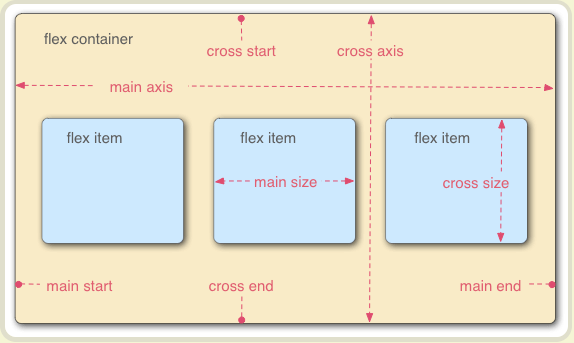<br>
项目默认沿主轴排列，单个项目占据的主轴空间叫做`main size`，占据的交叉轴空间叫`cross size`。

# 4 容器的属性

## 4.1 flex-direction： 决定主轴的方向
- row:主轴为水平方向，起点在左端
- row-reverse：主轴为水平方向，起点在右端
- column：主轴为垂直方向，起点在上沿- 
 column-reverse：主轴为垂直方向，起点在下沿<br>
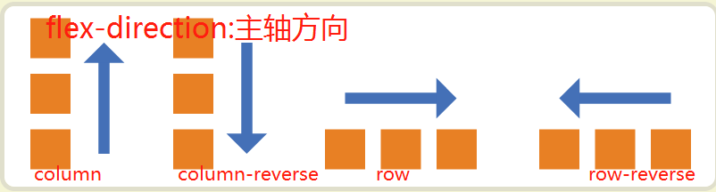<br>

## 4.2 flex-wrap：决定一条周线排列不下，如何换行
默认请看，项目都排在一条线上(又称`轴线`)。`flex-wrap`属性表示：如果一条周线排列不下，如何换行<br>
```html
<style>
.box{
  flex-wrap: nowrap | wrap | wrap-reverse;
}
</style>
```
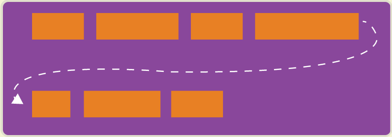<br>
- nowrap（默认）：不换行<br>
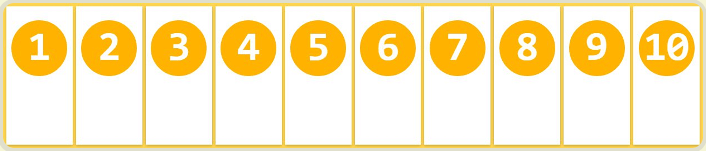<br>
- wrap: 换行,第一行在上方<br>
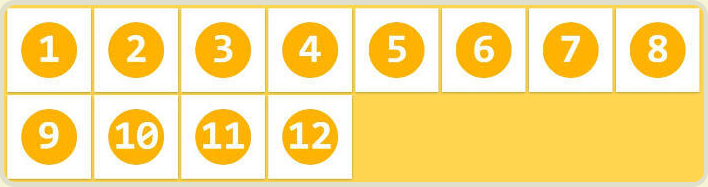<br>
- wrap-reverse> 换行，第一行在下方<br>
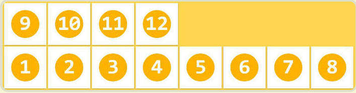<br>

## 4.3 flex-flow属性：flex-direction 和flex-wrap的合并属性
```html
<style>
    .box {
    flex-flow: <flex-direction> || <flex-wrap>;
    }
</style>
```

## 4.4 justify-content属性：定义项目在主轴线的对其方式
它可能取5个值，具体对齐方式与轴的方向有关。下面假设主轴为从左到右。<br>
- flex-start（默认值）：左对齐
- flex-end：右对齐
- center： 居中
- space-between：两端对齐，项目之间的间隔都相等。
- space-around：每个项目两侧的间隔相等。所以，项目之间的间隔比项目与边框的间隔大一倍。
```html
<style>
    .box {
        justify-content: flex-start | flex-end | center | space-between | space-around;
    }
</style>
```
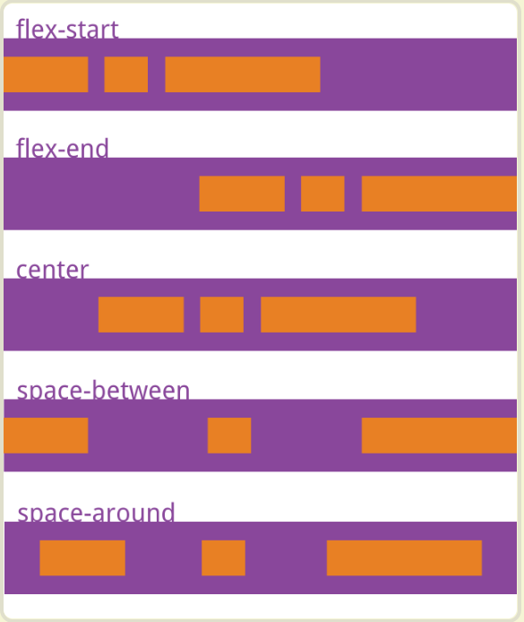<br>

## 4.5 align-items: 定义在交叉轴上如何对其
它可能取5个值。具体的对齐方式与交叉轴的方向有关，下面假设交叉轴从上到下:<br>
- flex-start：交叉轴的起点对齐。
- flex-end：交叉轴的终点对齐。
- center：交叉轴的中点对齐。
- baseline: 项目的第一行文字的基线对齐。
- stretch（默认值）：如果项目未设置高度或设为auto，将占满整个容器的高度。
```html
<style>
.box {
    align-items: flex-start | flex-end | center | baseline | stretch;
    }
</style>
```
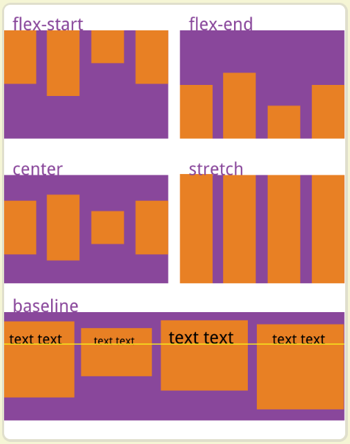<br>
## 4.6 algin-content: 定义了多根轴线的对齐方式。如果项目只有一根轴线，该属性不起作用
- flex-start：与交叉轴的起点对齐。
- flex-end：与交叉轴的终点对齐。
- center：与交叉轴的中点对齐。
- space-between：与交叉轴两端对齐，轴线之间的间隔平均分布。
- space-around：每根轴线两侧的间隔都相等。所以，轴线之间的间隔比轴线与边框的间隔大一倍。
- stretch（默认值）：轴线占满整个交叉轴。
```html
<style>
.box {
    align-content: flex-start | flex-end | center | space-between | space-around | stretch;
    }
</style>
```
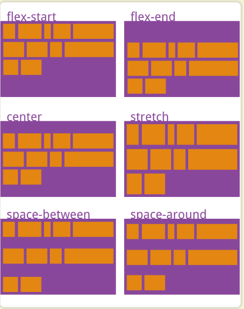<br>

# 5. 项目属性

## 5.1 order属性： 定义项目的排列顺序。数值越小，排列越靠前，默认为0
```html
<style>
.item {
  order: <integer>;
}
</style>
```
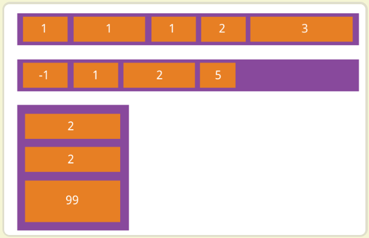<br>

## 5.2 flex-grow: 定义项目的放大比例，默认为0，即如果存在剩余空间，也不放大
如果所有项目的flex-grow属性都为1，则它们将等分剩余空间（如果有的话）。如果一个项目的flex-grow属性为2，其他项目都为1，则前者占据的剩余空间将比其他项多一倍<br>
```html
<style>
.item {
  flex-grow: <number>; /* default 0 */
}
</style>
```
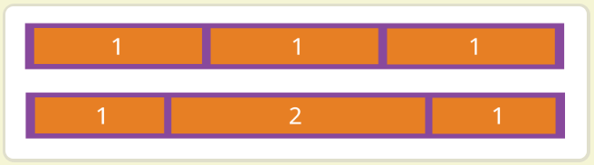<br>

## 5.2 flex-shrink:定义了项目的缩小比例，默认为1，即如果空间不足，该项目将缩小
如果所有项目的flex-shrink属性都为1，当空间不足时，都将等比例缩小。如果一个项目的flex-shrink属性为0，其他项目都为1，则空间不足时，前者不缩小。<br>
```html
<style>
.item {
  flex-shrink: <number>; /* default 1 */
}
</style>
```
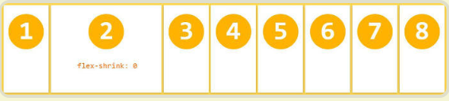<br>

## 5.3 flex-basic
定义了在分配多余空间之前，项目占据的主轴空间（main size）。浏览器根据这个属性，计算主轴是否有多余空间。它的默认值为auto，即项目的本来大小<br>
它可以设为跟width或height属性一样的值（比如350px），则项目将占据固定空间。<br>
```html
<style>
.item {
    flex-basis: <length> | auto; /* default auto */
}
</style>
```

## 5.4 flex
flex属性是flex-grow, flex-shrink 和 flex-basis的简写，默认值为0 1 auto。后两个属性可选。<br>
该属性有两个快捷值：`auto (1 1 auto)` 和 `none (0 0 auto)`。<br>
建议优先使用这个属性，而不是单独写三个分离的属性，因为浏览器会推算相关值。<br>
```html
<style>
.item {
    flex: none | [ <'flex-grow'> <'flex-shrink'>? || <'flex-basis'> ]
}
</style>
```

## 5.4 align-self属性
align-self属性允许单个项目有与其他项目不一样的对齐方式，可覆盖align-items属性。默认值为auto，表示继承父元素的align-items属性，如果没有父元素，则等同于stretch。<br>
```html
<style>
.item {
    /* 该属性可能取6个值，除了auto，其他都与align-items属性完全一致。 */
    align-self: auto | flex-start | flex-end | center | baseline | stretch;
}
</style>
```
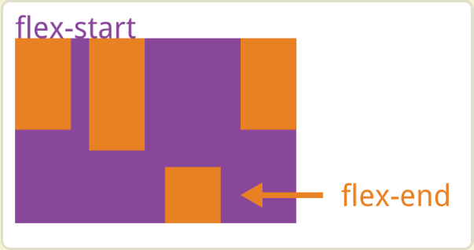<br>