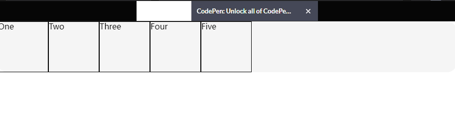

# 1.什么是flex布局
Flexible Box 模型，通常被称为flexbox。是一种一维布局。也就是只处理一个维度（一行或一列）的元素布局。<br>

## 1.1 flex的基本使用(display: flex| inline-flex)
当使用flex 布局，需要马上想到`主轴`与`交叉轴`。`主轴`就是`flex-direction`定义的，二另外一条则是垂直与它。默认横向轴为主轴。另外一条就是`交叉轴`。<br>

当为容器设置`display:flex`，便创建了flex容器，容器内的直系子元素，将变成`flex元素。`

```javascript
.wrapper {
  display: flex;
}
.wrapper>div {
  border: 1px solid;
}

<div class="wrapper">
   <div>One</div>
   <div>Two</div>
   <div>Three</div>
   <div>Four</div>
   <div>Five</div>
</div>
```
<br>

# 2. 属性预览

### 容器属性
|参数|说明|实例|
| -------|-------|-------|
|flex-direction | 定义flex布局的主轴方向| 默认值为flex-direction:row;<br> row: 水平(从左往右)<br>row-reverse: 水平(从右往左)<br> column: 垂直(从上往下)<br> column-reverse:垂直(从下往上)|
|flex-wrap|实现多行flex布局|flex-wrap: wrap;<br>|
|flex-flow| flex-direction(第一个数)与flex-wrap(第二个数)的缩写。|flex-flow: column wrap; 纵向为主轴，空间不够进行换行|
| align-items|`flex元素`在`交叉轴`方向的对齐方式|以默认主轴为水平方向为例：stretch: `flex元素`撑满 flex 容器<br>flex-start: `flex元素`的开始端的对齐<br>flex-end: `flex元素`的结束端对齐<br>center: `flex元素`居中对齐<br>: `flex元素``基线`对齐|
| justify-content| 设置`flex元素`在`主轴`方向的对齐方式。控制每行之间空间的分配。 |以主轴为水平方向为例：<br>stretch:拉升<br>flex-start: 按`flex容器`左侧对齐<br>flex-end: 按`flex容器`右侧对齐<br>center: 居中排列<br>space-around:均匀排列每个元素,每个元素周围分配相同的空间<br>space-between:均匀排列每个元素,首个元素放置于起点，末尾元素放置于终点<br>space-evenly:均匀排列每个元素, 每个元素之间的间隔相等|
| align-content|控制“多条主轴”的 `flex元素`在交叉轴的对齐。|值同justify-content|

### flex元素属性
|参数|说明|实例|
| -------|-------|-------|
| flex-grow| 在`flex-basic`的占用空间下，主轴拓展宽度，占用`可用空间`| flex-grow: 1 |
| flex-shrink| 主轴空间`不足`，将`flex元素`缩小到`flex-basic`设置的空间以下| flex-shrink: 1 |
| flex-basic| 设置`flex元素`占用的尺寸| flex-basic: 100px; 默认为auto。 |
| flex| flex: flex-grow flex-shrink flex-basic; 简写| flex: 1 1 200px;  |
| align-self|控制`交叉轴`上的单个 `flex元素`的对齐。| 通align-items参数一致|
| order | 指定单个项目并更改其在视觉顺序中的显示位置。| order: 1; |
# 3. 容器属性使用

## 3.1 flex-direction
更改`flex元素`的排列方向。
```javascript
.wrapper {
  border-radius: 20px;
  background-color: #f5f5f5;
  display: flex;
  flex-direction: row;
/*   flex-direction: row-reverse; */
/*   flex-direction: column; */
/*   flex-direction: column-reverse; */
}
.wrapper>div {
  border: 1px solid;
  min-width: 100px;
  min-height: 100px;
}


<div class="wrapper">
   <div>One</div>
   <div>Two</div>
   <div>Three</div>
   <div>Four</div>
   <div>Five</div>
</div>
```
<br>

## 3.2 flex-wrap
flex-wrap默认为`nowrap`，即使内容排放已经超出内容，导致溢出，仍然不会主动换行。此时需要设置位`flex-wrap:wrap;`,则会换行显示。<br>
```javascript
.wrapper {
  border-radius: 20px;
  background-color: #f5f5f5;
  display: flex;
  flex-direction: row;
  flex-wrap: wrap;
}
.wrapper>div {
  border: 1px solid;
  min-width: 100px;
  min-height: 100px;
}

<div class="wrapper">
   <div>One</div>
   <div>Two</div>
   <div>Three</div>
   <div>Four</div>
   <div>Five</div>
</div>
```
<br>


## 4.3 align-items
`align-items`用于设置`flex元素`在`交叉轴`的对齐方式。默认为`stretch`。<br>

```javascript
.wrapper {
  border-radius: 20px;
  background-color: #f5f5f5;
  display: flex;
/*   align-items: flex-start; */
/*   align-items: flex-end; */
/*   align-items: center; */
  min-height: 100px;
}
.wrapper>div {
  border: 1px solid;
}

<div class="wrapper">
   <div>One</div>
   <div>Two</div>
   <div>Three</div>
   <div>Four</div>
   <div>Five</div>
</div>
```


## 3.3 justify-content
设置`flex元素`在主轴方向的对齐方式。
- space-between： 首个元素放置于起点，末尾元素放置于终点。元素排列好后，将剩余空间均分到每个元素之间，所以元素之间间隔相等
- space-around: 每个元素周围分配相同的空间
- space-evenly：每个元素之间的间隔相等
- stretch：均匀排列每个元素，'auto'-sized 的元素会被拉伸以适应容器的大小
```javascript
.wrapper {
  border-radius: 20px;
  background-color: #f5f5f5;
  display: flex;
  min-height: 50px;
}
.wrapper>div {
  border: 1px solid;
}
.start {
  justify-content: start;
}
.end {
  justify-content: end;
}
.center {
  justify-content: center;
}
.between {
  justify-content: space-between;
}
.around {
  justify-content: space-around;
}
.evenly {
  justify-content: space-evenly;
}

<div class="wrapper start">
   <div>One</div>
   <div>Two</div>
   <div>Three</div>
   <div>Four</div>
   <div>Five</div>
</div><br>
<div class="wrapper center">
   <div>One</div>
   <div>Two</div>
   <div>Three</div>
   <div>Four</div>
   <div>Five</div>
</div><br>
<div class="wrapper end">
   <div>One</div>
   <div>Two</div>
   <div>Three</div>
   <div>Four</div>
   <div>Five</div>
</div><br>
<div class="wrapper between">
   <div>One</div>
   <div>Two</div>
   <div>Three</div>
   <div>Four</div>
   <div>Five</div>
</div><br>
<div class="wrapper around">
   <div>One</div>
   <div>Two</div>
   <div>Three</div>
   <div>Four</div>
   <div>Five</div>
</div><br>
<div class="wrapper evenly">
   <div>One</div>
   <div>Two</div>
   <div>Three</div>
   <div>Four</div>
   <div>Five</div>
</div>

```

<br>

# 4. flex元素属性使用
## 4.1 什么是可用空间

什么是`可用空间`？
 - 假如容器是500px, 有三个100px的元素，占用容器的300px,那么剩下的200px就是`可用空间`。<br>

## 4.2 (flex-grow, flex-shrink,flex-basic ) 或 flex
这三个属性主要作用是改变`flex容器`的`可用空间`。

 如果希望这些元素能够自动拓展填充剩余的可用空间，那么就需要利用flex属性来实现。<br>
- flex-basic: 定于`flex元素`的空间大小,在任何空间分配发生之前初始化弹性元素的尺寸。默认值为auto,设置后width将失效。
- flex-grow: 如果设置位正整数，会在`flex-basic`的基础上，沿`主轴`方向占用`可用空间`增长尺寸。如果其他`flex元素`也允许延展，则各自占用`可用空间`的一部分。`
- flex-shrink:处理`flex元素`收缩空间。当`flex容器`没有足够的空间将`flex元素`排列，如果`flex-shrink`设置为正整数，则将会缩小`flex元素`的占用空间到`flex-basic`以下尺寸。<br>

```javascript
.wrapper, .wrapper2 {
  border-radius: 20px;
  background-color: #f5f5f5;
  display: flex;
}
.wrapper>div, .wrapper2>div {
  border: 1px solid;
  min-height: 100px;

}
.wrapper>div {
  flex:1;
}
.wrapper2>div:first-child {
  flex:1;
}
.wrapper2>div {
  flex:2;
}

<div class="wrapper">
   <div>One</div>
   <div>Two</div>
   <div>Three</div>
   <div>Four</div>
   <div>Five</div>
</div>

<div class="wrapper2">
   <div>One</div>
   <div>Two</div>
   <div>Three</div>
   <div>Four</div>
   <div>Five</div>
</div>
    
```

<br>

分析例子：上图中`wrapper2`的第一个格子，`flex-grow: 1`,而其他格子`flex-grow:2`，因此在伸展的时候，宽度是其他的`1/2`。详细分解如下：

- `flex: initial;`: 等价 `flex:0 1 auto`,flex-grow为0，flex元素不允许超过`flex-basic`的尺寸。flex-shrink:1, 可缩小防止外溢。
- `flex: auto;`: 等价`flex: 1 1 auto`,既可以收缩，也可以拉升。
- `flex: none;`: 等价`flex: 0 0  auto`,不能拉升，也不能收缩，会按照`auto`布局。
- `flex: 1`： 等价 `flex: 1 1 0`,
- `flex: 2`: 等价与`flex: 2 1 0`,元素会在`flex-basic:0`的基础上伸缩。

## 4.3 align-self
用于对其`单个``flex元素`的对齐。所有属性同`align-items`一致。<br>
```javascript
.wrapper {
  border-radius: 20px;
  background-color: #f5f5f5;
  display: flex;
  min-height: 250px;
  flex-wrap: wrap;
  align-items: flex-start;
}
.wrapper>div {
  border: 1px solid;
  min-height: 50px;
}

.start {
  justify-content: start;
}
.start>div {
  flex: 1 0 30%;
  background: pink;
}
.start>div:first-child {
  align-self: center;
}

<div class="wrapper start">
   <div>One</div>
   <div>Two</div>
   <div>Three</div>
   <div>Four</div>
   <div>Five</div>
</div><br>

```
<br>


## 4.4 order 改变显示位子
设置order，会按照顺序排列。order数字越小，排列的位置越靠前。不设置order为0。（加入你想某一个块放在最前面，而默认的值都为0，可以将其设置为-1）。
```javascript
.wrapper {
  border-radius: 20px;
  background-color: #f5f5f5;
  display: flex;
  min-height: 250px;
}
.wrapper>div {
  border: 1px solid;
  min-height: 50px;
  flex: 0 0 10%;
  background: pink;
}

.one {
  order: 1;
}
.three {
  order: 3;
}

<div class="wrapper">
   <div class="one">One</div>
   <div class="two">Two</div>
   <div class="three">Three</div>
   <div class="four">Four</div>
   <div class="five">Five</div>
</div><br>

```
<br>

# 5 自动外边距在主轴对齐（利用margin属性:auto 占用剩余空间）

一般设置了`display:flex;`,所有`flex元素`会站在一排。此时可以使用`margin`属性，自动外边距占用全部多余的空间。
```JavaScript
.wrapper {
  border-radius: 20px;
  background-color: #f5f5f5;
  display: flex;
  min-height: 250px;
}
.wrapper>div {
  border: 1px solid;
  min-height: 50px;
  flex: 0 0 10%;
  background: pink;
}
.start>div:last-child {
  margin-left: auto;
}

<div class="wrapper start">
   <div>One</div>
   <div>Two</div>
   <div>Three</div>
   <div>Four</div>
   <div>Five</div>
</div><br>

```
<br>


# 6. 实例

## 6.1 gap布局实例
```javascript
.wrapper {
  border-radius: 20px;
  background-color: #f5f5f5;
  display: flex;
  height: 250px;
  flex-wrap: wrap;
  flex-direction: column;
  
}
.wrapper>div {
  border: 1px solid;
  flex: 1 1 50px;
  background: pink;
}
div.nine {
   flex-basis: 250px;
}

<div class="wrapper">
   <div>One</div>
   <div>Two</div>
   <div>Three</div>
   <div>Four</div>
   <div>Five</div>
   <div>Six</div>
   <div>seven</div>
   <div>eight</div>
   <div  class="nine">nine</div>
</div><br>

```
<br>

