# 1. 基本概念
grid布局中，最基本的单元就是网格线与网格。采用grid布局的元素，成为`grid容器(gride container)`。它的所有子元素自动成为容器成员，称为`grid 项目(grid item)`。<br>
分割的线组成了网格的结构，它们可以是垂直的(`列网格线`)或水平的(`行网格线`)。也可以在行或列的任一边。<br>
# 1.1 网格线（Grid Line ）
每条网格线具有默认的编号，从左到右，从上到下，分别为1,2,3....<br>
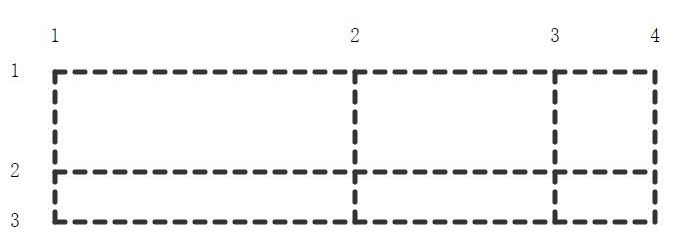<br>

# 1.2 网格单元格 ( Grid Cell )
两根`毗邻`的行网格线和列网格线中间的位置，它是一个独立的网格`单元`。<br>
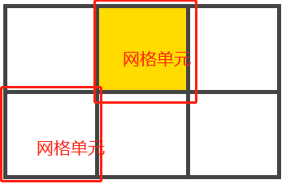<br>

# 1.3 网格轨道（Grid Track）
指两根毗邻线中间的位置。可以认为是网格的`行`或`列`。<br>
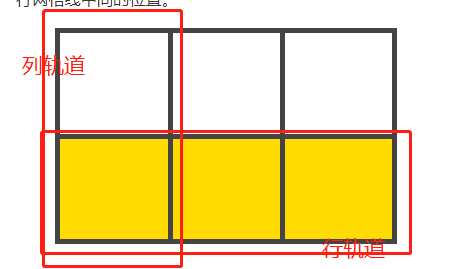<br>

# 1.4 网格区域(Grid Area)
指` 4 `根网格线包围的空间。一个网格可以由`任意数量的网格单元`构成。<br>
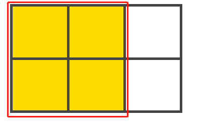<br>

# 2. 容器属性

# 2.1 display
display属性定义了一个网格容器，容器是展现为行内或块状由所给定的值而决定，此时，他的所有子元素进入grid文档流，称为grid项目。<br>
- grid: 定义了网格容器，它以块级元素的形式显示
- inline-grid: 定义了网格容器，它以内联元素的形式显示
- subgrid: 定义了一个网格容器，这个容器是其父级网格容器的一个子项。它的行和列的大小从父级网格容器中获取。
```html
<style>
    .box {
        display: grid | inline-grid | subgrid;
    }
</style>
```

## 2.1 grid-template-columns(网格单元的宽)/grid-template-rows(网格单元的高)
- 定义`网格单元`的`宽高`，单位可以是长度(px,em,rem,vw,vh)或百分比，也可以是我那个中自由空间的分数(单位为fr)
- 定义`网格线`的`名称`,它不是必须值，可以是一个任意选择的名字，当没有显示设置时，默认以`数字`表示。<br>
```html
<style>
    .box {
        display: grid;
        grid-template-columns: 40px 50px auto 50px 40px;
        grid-template-rows: 25% 100px auto;
    }
</style>
```
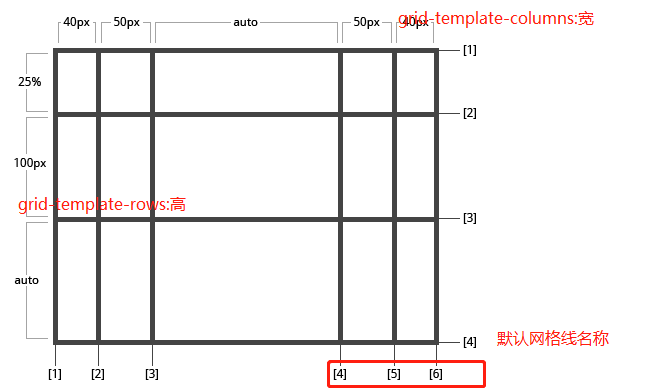<br>
为了更好地语义化，我们可以给网格线指定一个名字，注意网格线命名时的中括号语法：<br>
- 一根网格线可以有多个名字: 如下面的 `[row1-end row2-start]`
- 容器的重复部分可以使用`repeat`复用
- fr：特殊单位，类似于设定flex-grow时，给网格容器的自由空间设置的1个分数。
```html
<style>
    .box {
        display: grid;
        grid-template-columns: [first] 40px [line2] 50px [line4] auto [col4-start] 50px [five] 40px [en];
        grid-template-rows: [row1-start] 25% [row1-end row2-start]  100px [thrid-line] auto [last-line];
        /* 复用： 等价于：grid-template-columns: 20px [col-start] 20px [col-start] 20px [col-start] 5% */
        grid-template-columns:repeat(3, 20px [col-start]) 5%;

        /* grid轨道中，除掉第三个50px的宽度，其余的3等分。 */
        grid-template-columns: 1fr 1fr 50px 1fr;
    }
</style>
```
<br>

## 2.2 grid-template-areas
通过引用grid-area属性指定的网格区域名称来定义网络模板<br>
```html
   <style>
        .grid {
            display: grid;
            grid-template-columns: repeat(5, 100px);
            grid-template-rows: repeat(4, 100px);
            grid-template-areas: 
                "title title title title aside"
                "nav main main main aside"
                "nav main main main aside"
                "footer footer footer footer footer"
        }
        .title {
            grid-area: title;
            background-color: blue;
        }
        .nav {
            grid-area: nav;
            background-color: yellow;
        }
        .main {
            grid-area: main;
            background-color: gray;
        }
        .aside {
            grid-area: aside;
            background-color: green;
        }
        .footer {
            grid-area: footer;
            background-color: pink;
        }

    </style>
</head>
<body>
    <section class="grid">
        <div class="title">title</div>
        <div class="nav">nav</div>
        <div class="main">main</div>
        <div class="aside">aside</div>
        <div class="footer">footer</div>
    </section>
</body>
```
## 2.3 grid-column-gap（列间距） / grid-row-gap(行间距) / grid-gap（行/列间距）
定义了网格之间的间距<br>
grid-column-gap与grid-row-gap定义的值不包括网格项目到容器边缘的间距<br>
```html
<style>
    .box {
        grid-template-columns: 100px 50px 100px;
        grid-template-rows: 80px auto 80px;
        grid-column-gap: 10px;
        grid-row-gap: 15px;
        /* 行，列合并，行在前，列在后 */
        grid-gap: 2px 10px;
    }
</style>
```
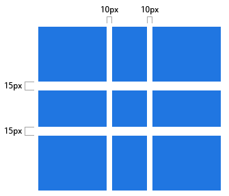<br>

## 2.4 justify-items/align-items
justify-items: `网格子项`的内容和`列`轴的对其方式。即`水平`方向上的对其方式。<br>
align-items: `网格子项`的内容和`行`轴对齐方式，即`垂直`方向上的对齐方式<br>
显而易见，类似于flex布局方式，利用此属性，我们能很容易地实现水平居中了<br>
- start代表内容和网格区域的左边(justify-items)/上边(align-items)对齐。
- end代表内容和网格区域的右边(justify-items)/下边(align-items)对齐。
- center代表内容和网格区域：横向(justify-items)/纵向(align-items)的中间对齐。
- stretch为默认值，代表填充整个网格区域：横向(justify-items)/纵向(align-items)的宽度。<br>
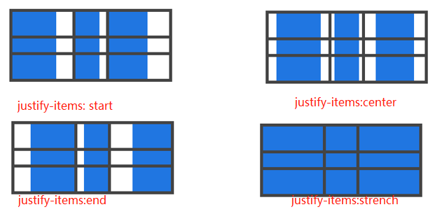<br>
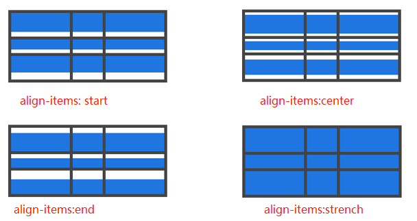<br>
备注：通过对grid项目设定justify-self属性把这个行为设置到单独的网格子项(自定义自己的justify-items属性)<br>

## 2.5 justify-content / align-content
沿着行/列轴线对齐网格项内的内容。<br>
这个属性很类似于Flexbox的justify-content属性<br>

- start代表网格在网格容器左边(justify-content)/上边(align-content)对齐。
- end代表网格在网格容器右边(justify-content)/下边(align-content)对齐。
- center代表网格在网格容器：横向(justify-content)/ 纵向(align-content)中间对齐。
- stretch改变网格子项的容量让其填充整个网格容器宽度。
- space-around代表在每个网格子项中间放置均等的空间，在始末两端只有一半大小。
- space-between代表在每个网格子项中间放置均等的空间，在始末两端没有空间。
- space-evenly代表在每个网格子项中间放置均等的空间，包括始末两端。<br>
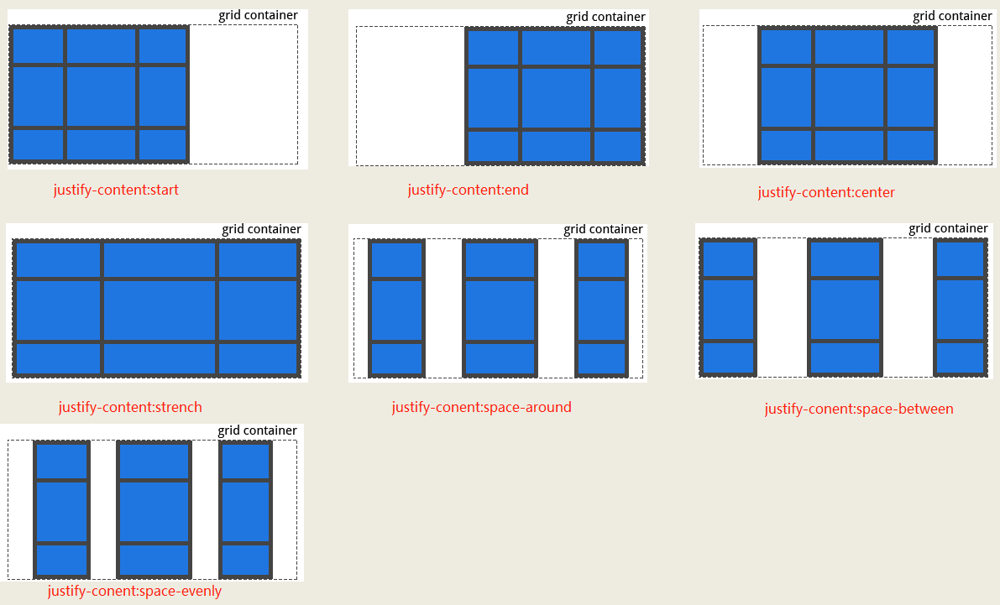<br>
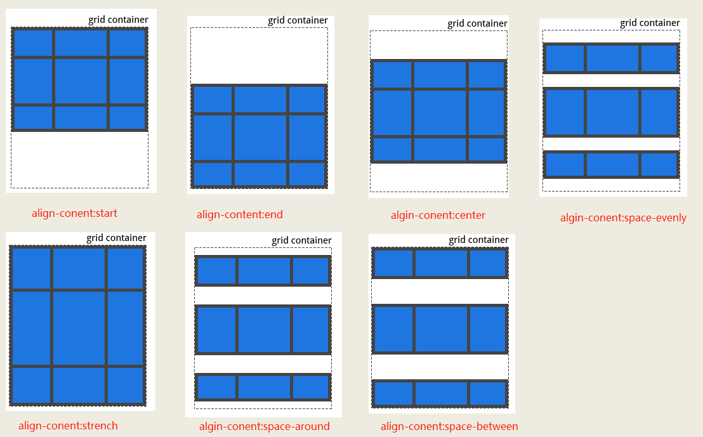<br>

## 2.6 grid-auto-columns/grid-auto-rows
指定任何自动生成的网格轨道(grid tracks)（又名隐式网格轨道）的大小。<br>
在你明确定位的网格范围超出定义的网格范围时，隐式网格轨道被创建了。<br>
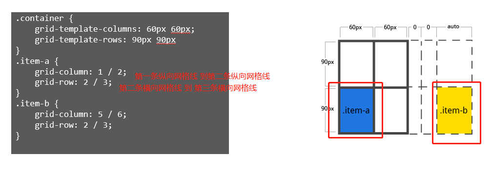<br>
```html
<style>
        .grid {
            display: grid;
            grid-template-columns: 100px;
            grid-template-rows: 100px;
            /* 隐式生出来的列：宽度为50px。但是第一个显示的宽/高都是不变的 */
            grid-auto-columns: 50px; 
            /* 隐式生出来的行：高度为70px。但是第一个显示的宽/高都是不变的 */
            grid-auto-rows: 70px;
        }
        .box1 {
            grid-column: 1/2;
            grid-row: 1;
            background-color: red;
        }
        .box2 {
            grid-column: 2;
            grid-row: 1/2;
            background-color: green;
        }
        .box3 {
            grid-column: 1/2;
            grid-row: 2/4;
            background-color: darkgray;
        }
        .box4 {
            grid-column: 2;
            grid-row: 2;
            background-color: hotpink;
        }

    </style>
</head>
<body>
    <section class="grid">
        <div class="box1">box1</div>
        <div class="box2">box2</div>
        <div class="box3">box3</div>
        <div class="box4">box4</div>
    </section>
</body>
```
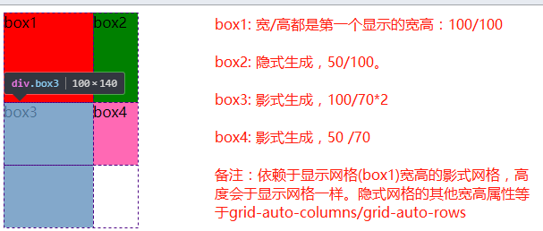<br>

## 2.7 grid-auto-flow
如果你有一些没有明确放置在网格上的网格项，自动放置算法会自动放置这些网格项。该属性控制自动布局算法如何工作。<br>
- row：告诉自动布局算法依次填充每行，根据需要添加新行
- column：告诉自动布局算法依次填入每列，根据需要添加新列
- dense：告诉自动布局算法在稍后出现较小的网格项时，尝试填充网格中较早的空缺。（我们尽量不要将这个属性设置为dense，因为它可能让我们的页面布局产生混乱。）<br>
```html
<style>
    .container {
        display: grid;
        grid-template-columns: 60px 60px 60px 60px 60px;
        grid-template-rows: 30px 30px;
        grid-auto-flow: row;
    }
    .item-a {
    grid-column: 1;
    grid-row: 1 / 3;
    }
    .item-e {
    grid-column: 5;
    grid-row: 1 / 3;
    }

    </style>
</head>
<body>
    <section class="container">
        <div class="item-a">item-a</div>
        <div class="item-b">item-b</div>
        <div class="item-c">item-c</div>
        <div class="item-d">item-d</div>
        <div class="item-e">item-e</div>
    </section>
</body>
```
上述例子中，只指定了开始和结束的item的位置，剩下的都按照`row`行排列的方式自动分配。<br>
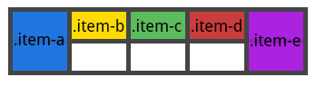<br>
如果将`grid-auto-flow: column`，那就将按照`column`方式进行排列<br>
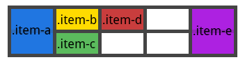<br>

# 3. 网格项属性
## 3.1 grid-column-start /grid-column-end/grid-row-start/grid-row-end
- grid-column-start: 网格项目垂直方向的开始位置网格线。
- grid-column-end: 网格项目垂直方向的结束位置网格线。
- grid-row-start: 网格项目水平方向的开始位置网格线。
- grid-row-end: 网格项目水平方向的结束位置网格线。
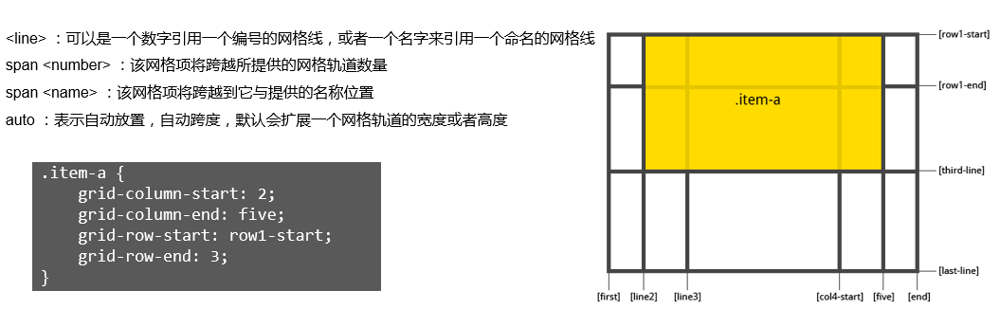<br>

## 3.2 grid-column / grid-row
grid-column: grid-column-start + grid-column-end 缩写<br>
grid-row: grid-row-start + grid-row-end 缩写<br>
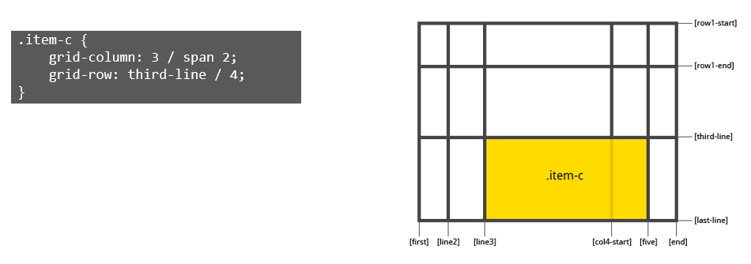<br>

## 3.3 grid-area
前面有grid-area 调用grid-template-areas属性创建模板的例子。而这个属性也可以是`grid-row-start, grid-row-end, grid-column-start,grid-column-end`的缩写。
```html
<style>
    /* 注意这里的顺序：row-start, column-start ,row-end,column-end */
    .item {
        grid-area: <name> | <row-start> / <column-start> / <row-end> / <column-end>;
    }

    /* 例子 */
    .item-d {
        grid-area: 1 / col4-start / last-line / 6
    }
</style>
```
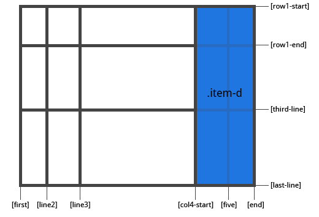<br>

## 3.4 justify-self / align-self
自定义网格的内容对齐方式，如果没有设置，则默认使用容器中设置的justify-context和align-context。<br>
justify-self：定义该网格单元的内容和列轴对齐方式，即水平方向上的对齐方式。<br>
align-self: 定义了该网格单元的内容和水平轴对齐方式，即垂直方向上的对齐方式。<br>

- start代表该网格单元和网格区域的左边(justify-self)/ 上边(align-self)对齐。
- end代表该网格单元和网格区域的右边(justify-self)/下边(align-self)对齐。
- center代表该网格单元和网格区域的:水平(justify-self)/垂直(algin-self)中间对齐。
- stretch为默认值，代表填充整个网格:水平(justify-self)/垂直(algin-self)区域的宽度。<br>
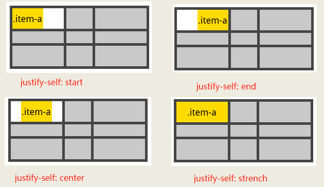<br>

# 4 实例

# 4.1 水平/垂直居中
类似于flex，我们，我们可以通过设置justify-items与align-items的值为center，让仅有一个网格单元的容器内的网格项目在网格容器中水平垂直居中对齐，实现水平/垂直居中。<br>
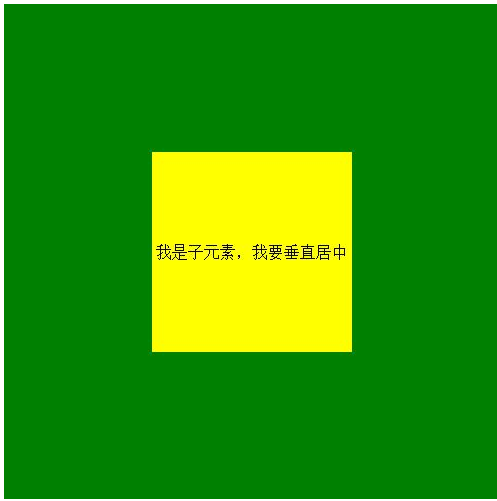<br>
```html
<style>
    .box {
        display: grid;
        justify-content: center;
        align-content: center;
        height: 500px;
        width: 500px;
        background: green;
    }
    .conent {
        height: 200px;
        width: 200px;
        background: red;
        line-height: 200px;
        text-align: center;
    }
</style>
<body>
    <div class="box">
        <div class="content">我是子元素，我要垂直居中</div>
    </div>
</body>
```
## 4.2 两栏/三栏布局
现在我们不仅可以利用flex，也可以使用grid，轻松实现页面布局中的常见问题：两栏/三栏布局。<br>
```html
    <style>
        .box {
            display: grid;
            height: 200px;
            width: 100%;
            grid-template-columns: 200px auto;
        }
        
        .left {
            height: 00px;
            background: yellow;
        }
        .main {
            height: 200px;
            background: green;
        }
        </style>
    <body>
        <div class="box">
            <div class="left">left</div>
            <div class="main">main</div>
        </div>
        
    </body>
```
## 4.3 圣杯布局
使用grid也是十分容易就能实现圣杯布局了，而且具有良好的语义化。
```html
 <style>
    .box {
        display: grid;
        height: 500px;
        grid-template-rows: 50px auto 50px;
    }
    .top {
        background: yellow;
    }
    .footer {
        background: green;
    }
    .main {
        display: grid;
        grid-template-columns: 50px auto 50px;
    }
    .nav {
        background: red;
    }
    .content {
        background: thistle;
    }
    .aside {
        background: slateblue;
    }
    </style>
<body>
    <div class="box">
        <div class="top">top</div>
        <div class="main">
            <div class="nav">nav</div>
            <div class="content">content</div>
            <div class="aside">aside</div>
        </div>
        <div class="footer">footer</div>
    </div>
</body>
```