# 1. 什么是网格布局

网格是`水平线`与`垂直线`相交形成了有`列`与`行`的网格。放在`列`与`行`交汇的位置 为`网格元素`。<br>

网格布局为二位布局, 弹性盒子(flexbox)为一维布局。如何选择用那种布局？<br>

- 只需要按行`或者`列控制布局，使用弹性盒子
- 如果要同时行`和`列控制布局，使用网格布局

# 2. 网格容器(display: grid | display: inline-grid)

其实直接设置`display:grid`属性，并不会有什么特殊效果。它与设置`display: block`效果一样，都是整整齐齐一行一行显示。

```javascript
.wrapper {
  display: grid;
}
.wrapper>div {
  border: 1px solid;
}

<div class="wrapper">
   <div>One</div>
   <div>Two</div>
   <div>Three</div>
   <div>Four</div>
   <div>Five</div>
</div>
```

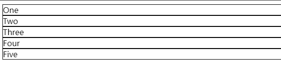<br>

## 2.1 属性预览

#### 容器属性

| 参数                         | 说明                                                                                                                          | 实例                                                                                |
| ---------------------------- | ----------------------------------------------------------------------------------------------------------------------------- | ----------------------------------------------------------------------------------- |
| grid-template-columns        | 网格中的列                                                                                                                    | grid-template-columns: 200px 200px 200px;                                           |
| grid-template-rows           | 网格中的行                                                                                                                    | grid-template-rows: 200px 200px                                                      |
| grid-template-areas          | 结合 grid-area css 属性先给每个网格命名，然后通过该属性根据命名指定区域位置                                                   | 三行四列<br>grid-template-areas: <br> "hd hd hd hd"<br>"sd sd sd"<br>"ft ft ft ft"; |
| grid-template                | grid-template-rows 与 grid-template-columns 简写， [参考地址](https://developer.mozilla.org/zh-CN/docs/Web/CSS/grid-template) |                                                                                     |
| grid-auto-rows               | 多余网格中的行                                                                                                                | grid-auto-rows: 200px 200px                                                          |
| grid-auto-columns            | 多余网格中的列                                                                                                                | grid-auto-rows: 200px 200px                                                          |
| align-items                  | 容器属性，控制`网格项`（相对网格项）的对其方式，设置在`网格容器`上。  | align-items: start; <br/>(start \| end \| center \| stretch)                        |
| justify-items                | 容器属性，控制`网格项`（相对于`网格项`）的水平对齐方式。主要是`网格项自己对其方式`                   | justify-items: start; <br/>(start \| end \| center \| stretch)                      |
| justify-content| 容器属性，控制`网格列`的水平对齐方式。主要是网格列一列列对其方式。| start\|end\|center\|space-between\|space-around|
| align-content| 容器属性，控制`网格列`的`垂直`对齐方式。设置在`网格容器`上。| start\|end\|center\|space-between\|space-around|
| place-items                  | 是 align-items 与 justify-items 的简写。                                                                                      | place-items: center stretch; <br>                                                   |
| grid-column-gap \/column-gap | 网格列间距                                                                                                                    | grid-column-gap: 10px; <br>column-gap: 10px;                                        |
| grid-row-gap \/row-gap       | 网格行间距                                                                                                                    | grid-row-gap: 10px;<br>row-gap: 10px;                                               |
| grid-gap \/ gap              | 行与列合并编写                                                                                                                | rgid-gap: 10px 40px; <br> gap: 10px 40px                                            |
tips: 浏览器后续将删除 grid-column-gap /grid-row-gap/ grid-gap 的前缀`grid`。

#### 项目属性

| 参数              | 说明                                                                                                                                                       | 实例                                                                                                                                                                                                                                                                                                         |
| ----------------- | ---------------------------------------------------------------------------------------------------------------------------------------------------------- | ------------------------------------------------------------------------------------------------------------------------------------------------------------------------------------------------------------------------------------------------------------------------------------------------------------ |
| grid-column-start | 格子从哪一列开始                                                                                                                                           | grid-column-start: 1                                                                                                                                                                                                                                                                                         |
| grid-column-end   | 格子从哪一列结束                                                                                                                                           | grid-column-end: 2                                                                                                                                                                                                                                                                                           |
| grid-column       | grid-column-start 与 grid-column-end 的简写                                                                                                                | grid-column: 1/2; <br> （范围第一列到第二列）<br>如果跨度只有 1 格子，默认就是一个格子，也饿可以简写为 grid-column: 1;                                                                                                                                                                                       |
| grid-row-start    | 格子从哪一行开始                                                                                                                                           | grid-row-start: 1                                                                                                                                                                                                                                                                                            |
| grid-row-end      | 格子从哪一行结束                                                                                                                                           | grid-row-end: 1                                                                                                                                                                                                                                                                                              |
| grid-row          | grid-row-start 与 grid-row-end 的简写                                                                                                                      | grid-row: 1/4; <br> （范围第一行到第四行）                                                                                                                                                                                                                                                                   |
| grid-area         | 网格区域缩写，顺序为 grid-row-start\/ grid-column-start\/grid-row-end\/grid-column-end。第二种不使用方式，直接给网格命名，结合 grid-template-area 布局使用 | 第一种：grid-area: 1/1/4/2 <br>第二中： grid-area: 'header';详细使用后面会阐述。                                                                                                                                                                                                                             |
| grid-auto-flow    | 控制着自动布局算法怎样运作，精确指定在网格中被自动布局的元素怎样排列                                                                                       | grid-auto-flow:row;:逐行填充来排列元素，在必要时增加新行<br>grid-auto-flow:column;逐列填充来排列元素，在必要时增加新列<br>grid-auto-flow:dense;自动布局算法使用一种“稠密”堆积算法，如果后面出现了稍小的元素，则会试图去填充网格中前面留下的空白<br>grid-auto-flow:row dense;<br>grid-auto-flow:column dense; |
| align-self        | 设置到格子上，覆盖已有的 align-items 的值。                                                                                                                | align-self：start                                                                                                                                                                                                                                                                                            | center | end | stretch; 默认为 stretch. |
| justify-self      | 设置到格子上，覆盖已有的 justify-items 的值。                                                                                                              | align-self：start                                                                                                                                                                                                                                                                                            | center | end | stretch; 默认为 stretch. |
| place-self        | 是 align-self 与 justify-self 的简写。                                                                                                                     | place-self: center stretch; <br>                                                                                                                                                                                                                                                                             |

tips: 我总是在 align-items, align-content, justify-items, justify-content这四个属性弄混淆。再做一个总结：<br>
flex: 一维布局，`justify-content`设置`flex容器`主轴所有`flex元素`的对其方式，`align-items`设置`交叉轴`的`flex元素`的对其方式。<br>
grid: 二维布局。`justify-content`与`align-content`分别控制`网格列一整个列`或`网格列一整行`的对其方式。而`align-items`与`justify-items`控制`网格元素`在垂直或者水平方向的对其方式，参照物为`网格元素自己`。


# 3. 容器属性使用

## 3.1 轨道大小设置（fr,repeat(), minmax(),auto-fill,auto-fit）了解

可作为`grid-template-columns | grid-template-rows | grid-template-rows | grid-template-columns`的值。<br>

| 行列方式设置          | 描述                                                                          | 实例                                                                                                      |
| --------------------- | ----------------------------------------------------------------------------- | --------------------------------------------------------------------------------------------------------- |
| fr                    | 等分单位，可将网格容器可用空间划分为多个等分空间。感觉与百分比很像，          | grid-template-columns: 1fr 2fr 1fr;<br> (将列空间分为 4 等分，第一列第三列分别占 1 等分，第二列占 2 等分) |
| repeat(num, 长度单位) | 重复轨道创建。将`长度单位`重复 `num`次                                        | grid-template-rows: 1fr repeat(2, 1fr 2fr); <br>(等价与 grid-template-rows: 1fr 2fr 1fr 2fr;)             |
| minmax(min, max)      | 可设置网格的最小值与最大值。也可以将值设置位 auto(尺寸将根据内容大小自动变换) | grid-template-rows: minmax(100px, auto);<br/>                                                             | 第一行设置位 100px, 第二行根据内容自适应 |
| auto-fill             | 自动填充，让一行或一列尽可能多地容纳更多的单元格                              | grid-template-columns: repeat(auto-fill, 200px)<br> （自动分配格子宽度，最大不超过 200）                  |
| span 关键字           | 使用`起始线与跨越轨道数量`的定位方法,用于 grid-column 与 grid-row             | grid-column: 1 \/span 2; <br> 从 1，横跨 2，则到 3。等价 grid-column-start: 1; grid-end-start: 3;         |

## 3.2 grid-template-columns 与 grid-template-rows 使用

```javascript
.wrapper {
  display: grid;
  // 固定px
  grid-template-columns: 100px 200px 100px;
  grid-template-rows:100px 200px 100px;

  // fr
  grid-template-columns: 1fr 2fr 1fr;
  grid-template-rows: 1fr 2fr 1fr;

}
.wrapper>div {
  border: 1px solid;
}

<div class="wrapper">
   <div>One</div>
   <div>Two</div>
   <div>Three</div>
   <div>Four</div>
   <div>Five</div>
</div>
```

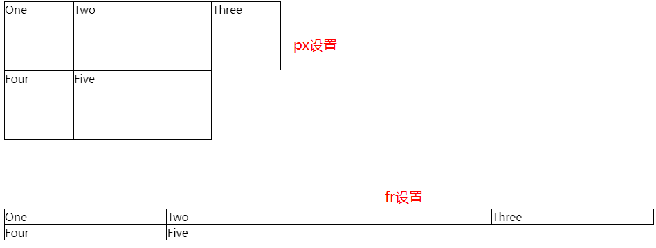<br>

## 3.3 grid-auto-rows 与 grid-auto-columns 使用

### 显示网格与隐式网格

显示网格： 使用`grid-template-rows | grid-template-columns | grid-template-areas` 定义网格后，形成了固定数量的`网格线`与`网格轨道`，这种手动定义的 Grid 称为`显示网格`。<br>
隐式网格：如果`网格项`的数量多余`网格单元格`，或`网格项`位于`显示网格`外部，则`网格容器`将通过向`网格`添加`网格线`，自动生成`网格轨道`。`显示网格`与 这些`额外的隐式轨道与网格线`一起形成所谓的`隐式网格`。<br>

可以在隐式网格中使用`grid-auto-column`与`grid-auto-rows`设置轨道的大小尺寸。例如下面的例子，只设置了`3列一行`，那么`Four`and `five`两个网格，将自由显示分配。<br>

```javascript
.wrapper {
  display: grid;
  grid-template-columns: 1fr 2fr 1fr;
  grid-template-rows: 1fr;
}
.wrapper>div {
  border: 1px solid;
}

<div class="wrapper">
   <div>One</div>
   <div>Two</div>
   <div>Three</div>
   <div>Four</div>
   <div>Five</div>
</div>
```

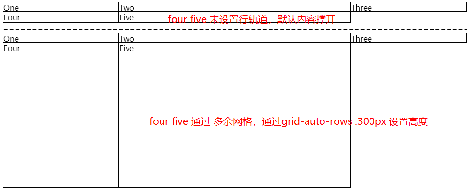<br>

## 3.4 grid-row-gap 与 grid-column-gap 使用

网格间距：纵向/横向相邻的网格单元之间可以使用`grid-column-gap | grid-row-gap`属性创建网格间距。<br>

间距使用的空间会在 使用弹性长度 fr 的轨道的空间计算前就被留出来，间距的尺寸定义行为和普通轨道一致，但不同的是你不能向其中插入任何内容。从以基线定位的角度来说，间距就像一条很宽的基线。<br>

```javascript
.wrapper {
  border-radius: 30px;
  padding: 50px;
  background-color: #f5ecec;

  display: grid;
  grid-template-columns: repeat(3, 1fr);
  grid-template-rows: 50px 50px;
  grid-column-gap: 10px;
  grid-row-gap: 20px;
}

.wrapper>div, .wrapper2>div {
   border: 1px solid #b5b1b1;
}

<div class="wrapper">
   <div class="box1">One</div>
   <div class="box2">Two</div>
   <div>Three</div>
   <div>Four</div>
   <div class="box5">Five</div>
</div>
```

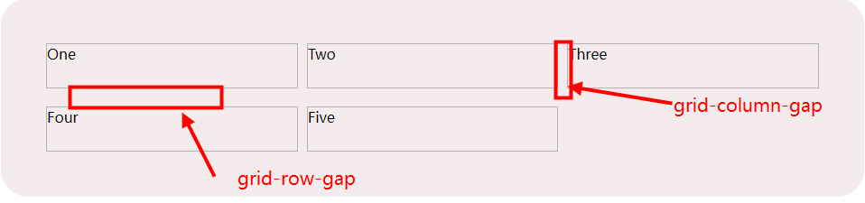<br>

## 3.5 align-items 与 justify-items（盒对齐块轴)

`align-items`是对网格的垂直方向进行对其。`justify-items`是对网格的水平方向对其。<br/>

```javascript
.wrapper {
  border-radius: 30px;
  height: 200px;
  background-color: #f5ecec;

  display: grid;
  grid-template-columns: repeat(4, 1fr);
  grid-template-rows: 100px 100px;
  align-items: start;
}
.box1 {
 align-self: end;
}
.box2 {
  align-self: stretch;
}
.box4 {
  align-self: center;
}
.wrapper>div, .wrapper2>div {
   border: 1px solid #b5b1b1;
}

<div class="wrapper">
   <div class="box1">One</div>
   <div class="box2">Two</div>
   <div>Three</div>
   <div class="box4">Four</div>
   <div class="box5">Five</div>
</div>

```

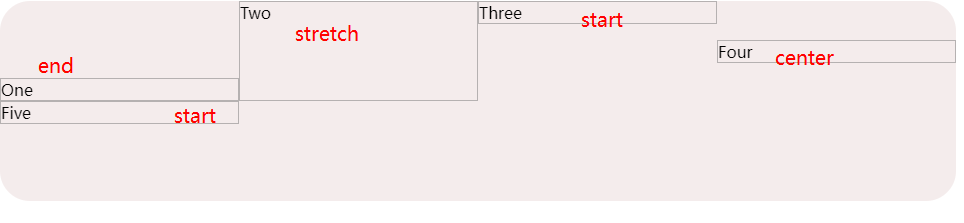

## 3.6 jusfify-items 与 justify-self（盒对齐行轴）

```javascript
.wrapper {
  border-radius: 30px;
  height: 200px;
  background-color: #f5ecec;
  display: grid;
  grid-template-columns: repeat(5, 1fr);
  justify-items: start;
}
.box1 {
 justify-self: center;
}
.box2 {
  justify-self: stretch;
}
.box4 {
  justify-self: end;
}
.wrapper>div, .wrapper2>div {
   border: 1px solid #b5b1b1;
  background: #d9480f;
  min-width: 100px;
}

<div class="wrapper">
   <div class="box1">One</div>
   <div class="box2">Two</div>
   <div>Three</div>
   <div class="box4">Four</div>
</div>
```

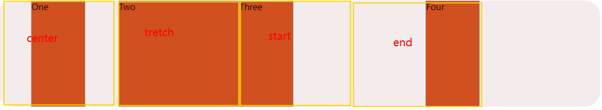<br>

#### place-items 与 place-self 内容居中

place-items:center; => justify-items:center;align-items:center;<br>
place-self:center; => justify-self:center;align-self:center;<br>

因此我们想让内容居中的时候，就很简单了。

```javascript
.wrapper {
  border-radius: 30px;
  height: 200px;
  background-color: #f5ecec;
  display: grid;
  place-items: center;
}

.item1 {
   border: 1px solid #b5b1b1;
   background: #d9480f;
   min-width: 100px;
   min-height:100px;
/*   place-self: center; */
}


<div class="wrapper">
 <div class="item1">Item 1</div>
</div>

```

<br>

## 3.7 justify-content 与 justify-self，align-content 与 align-self

#### justify-\*

justify-content: 控制`网格列`的水平对齐方式。设置在`网格容器`上。不适用在`网格项`的对其方式。`主要是网格列一列列对其方式    `。<br>
justify-items: 控制`网格项`（相对于`网格项`）的水平对齐方式，设置在`网格容器`上。主要是`网格项自己对其方式`<br>
justify-self: 个别`网格项` `覆盖`justify-content`的 值。<br>


#### align-\*

align-content: 控制`网格列`的`垂直`对齐方式。设置在`网格容器`上。<br>
align-items: 控制`网格项`（相对网格项）的对其方式，设置在`网格容器`上。<br>
align-self: 个别`网格项` `覆盖`align-content`的 值。<br>

tips:拉伸(stretch)会改变任何自动调整大小的元素的宽度，但不会改变固定大小的元素。并且更改将使得这些调整大小的元素中的每一个都获得相同的空间量。<br/>

相关属性：<br/>
|参数|说明|
|----|----|
| normal| 默认对齐|
|start | 对齐容器的起始边框 |
| end |对齐容器的结束边框|
|center | 容器内部居中|
|stretch |项目大小没有指定时，拉伸占据整个网格容器|
|space-around | 每个项目两侧的间隔相等。所以，项目之间的间隔比项目与容器边框的间隔大一倍 |
|space-between | 项目与项目的间隔相等，项目与容器边框之间没有间隔|
|space-evenly|项目与项目的间隔相等，项目与容器边框之间也是同样长度的间隔|


```javascript
.grid-container {
    display: grid;
    grid-template-columns: auto 50px auto;
    justify-content: space-evenly;
/*     justify-content: space-around;
    justify-content: space-between;
    justify-content: stretch;
    justify-content:end;
    justify-content:center; */
/*    justify-content:start; */
}

.item {
  background-color: #423d3d;
  padding: 20px;
  color: #fff;
  border: 1px solid #fff;
}


<div class="grid-container grid-container--fill">
  <div class="item">1</div>
  <div class="item">2</div>
  <div class="item">3</div>
  <div class="item">4</div>
  <div class="item">5</div>
  <div class="item">6</div>
  <div class="item">7</div>
</div>
```

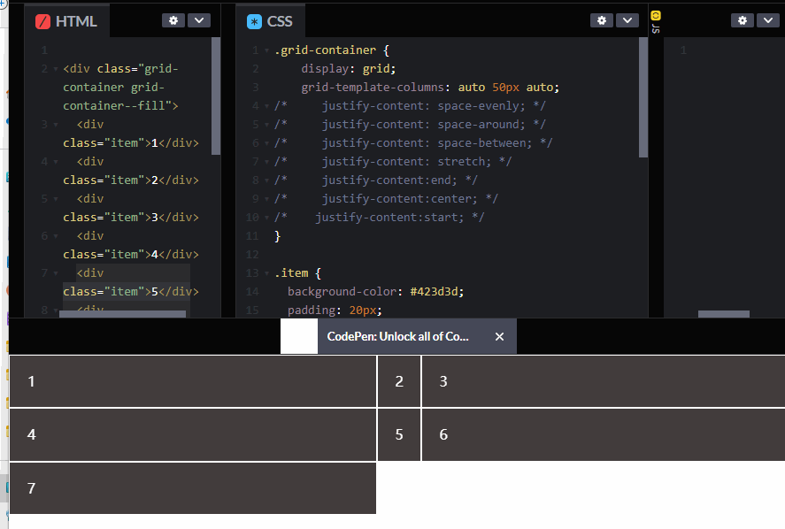<br>


## 3.8 自动填充轨道(repeat 方法的使用)

弹性盒子会根据空间调整行中的元素个数，二网格布局永远是固定的轨道个数。利用`auto-fill`可以实现弹性布局的效果。下面例子中，格子元素最大值为 200，可以自由填充满一整行。

```javascript
.wrapper {
  display: grid;
  grid-template-columns: repeat(auto-fill, 200px);
  background-color: #f5ecec;
}
.wrapper>div, .wrapper2>div {
   border: 1px solid #b5b1b1;
}
<div class="wrapper">
  <div>One</div>
  <div>Two</div>
  <div>Three</div>
</div>
```

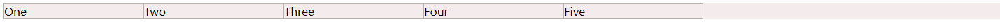<br/>

## 3.9 auto-fit 与 auto-fill 区别

区别只在于单行时对剩余空间的处理，fill 是有足够空间就创建空白列，剩余不到一列时才均分该剩余空间，fit 是直接均分剩余空间。<br>

- auto-fill: 倾向于容纳更多的列，所以如果在满足宽度限制的前提下还有空间能容纳新列，那么它会暗中创建一些列来填充当前行。即使创建出来的列没有任何内容，但实际上还是占据了行的空间。<br>
- auto-fit: 倾向于使用最少列数占满当前行空间，浏览器先是和 auto-fill 一样，暗中创建一些列来填充多出来的行空间，然后坍缩（collapse）这些列以便腾出空间让其余列扩张。<br>

```javascript
.grid-container {
    display: grid;
}
.grid-container--fill {
    grid-template-columns: repeat(auto-fill, minmax(100px, 1fr));
}
.grid-container--fit {
    grid-template-columns: repeat(auto-fit, minmax(100px, 1fr));
}
.item {
  background-color: #423d3d;
  padding: 20px;
  color: #fff;
  border: 1px solid #fff;
}

hr {
  margin: 80px;
}


auto-fill
<div class="grid-container grid-container--fill">
  <div class="item">1</div>
  <div class="item">2</div>
  <div class="item">3</div>
  <div class="item">4</div>
  <div class="item">5</div>
  <div class="item">6</div>
  <div class="item">7</div>
</div>

<hr>
auto-fit
<div class="grid-container grid-container--fit">
   <div class="item">1</div>
  <div class="item">2</div>
  <div class="item">3</div>
  <div class="item">4</div>
  <div class="item">5</div>
  <div class="item">6</div>
  <div class="item">7</div>
</div>
```

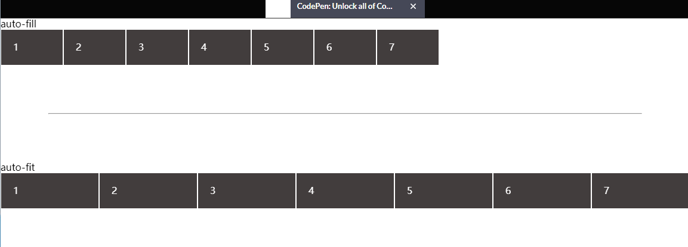<br>

[详细参考](https://juejin.cn/post/6844903565463388168)

## 3.10 自动定位实例(grid-auto-flow: dense)

`grid-auto-flow`属性控制着自动布局算法怎样运作，精确指定在网格中被自动布局的元素怎样排列。<br>

解析：`grid-template-columns: repeat(auto-fit, minmax(200px, 1fr));`:<br>
自动填充轨道，每个轨道的最小值为 200px, 浏览器将按 200px 计算出一行存放网格的个数，浏览器就会把剩余的空间等分成以最大 1fr 单位计算的区域给其他元素。

```javascript
.media, .media2 {
 border: 2px solid #f76707;
    border-radius: 5px;
    background-color: #fff4e6;
    display: grid;
    grid-template-columns: repeat(auto-fit, minmax(300px, 1fr));
    gap: 10px;
    grid-auto-rows: auto;
}

.media2 {
  grid-auto-flow: column dense;
}
.media>div, .media2 >div {
  border: 1px solid #423d3d;
  padding:10px;
}

<div class="media">
    <div class="text">This is a media object example.
      We can use grid-template-areas to switch around the image and text part of the media object.
    </div>
   <div class="text">This is a media object example.
      We can use grid-template-areas to switch around the image and text part of the media object.
    </div>
   <div class="text">This is a media object example.
      We can use grid-template-areas to switch around the image and text part of the media object.
    </div>
</div>

<div class="media2">
    <div class="text">This is a media object example.
      We can use grid-template-areas to switch around the image and text part of the media object.
    </div>
   <div class="text">This is a media object example.
      We can use grid-template-areas to switch around the image and text part of the media object.
    </div>
   <div class="text">This is a media object example.
      We can use grid-template-areas to switch around the image and text part of the media object.
    </div>
</div>
```

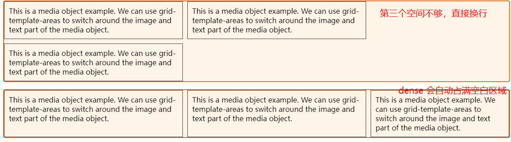<br>

# 4. 网格项目属性使用

## 4.1 网格线 / 网格单元 / 网格区域概念

网格线： 网格轨道设置 2 行 3 列后，会出现 3 条横网格线（从上往下 1,2,3）、4 条列网格线（从左往右 1,2,3,4）。<br/>
网格单元：网格单元是网格中最小的单位。<br>
网格区域：网格元素横向或者纵向扩展，创建出的网格区域。<br>

## 4.2 grid-column-start/grid-column-end/ grid-row-start/grid-row-end 使用

- grid-column-start 属性：左边框所在的垂直网格线
- grid-column-end 属性：右边框所在的垂直网格线
- grid-row-start 属性：上边框所在的水平网格线
- grid-row-end 属性：下边框所在的水平网格线<br/>

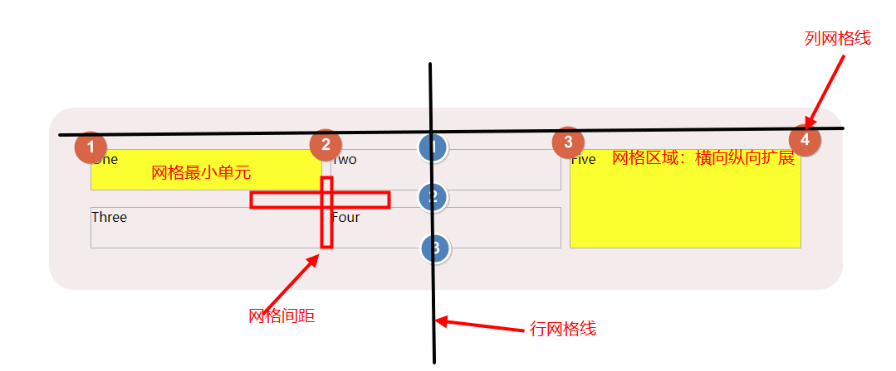<br/>

图例参考代码： <br/>

```javascript
.wrapper {
  border-radius: 30px;
  padding: 50px;
  background-color: #f5ecec;

  display: grid;
  grid-template-columns: repeat(3, 1fr);
  grid-template-rows: 50px 50px;

  // 创建网格间距
  grid-column-gap: 10px;
  grid-row-gap: 20px;
}

// 利用网格属性创建网格区域
.box5 {
  grid-column-start: 3;
  grid-column-end: 4;
  grid-row-start: 1;
  grid-row-end: 3;
}
.box5, .box1 {
  background-color: yellow;
}
.wrapper>div, .wrapper2>div {
   border: 1px solid #b5b1b1;
}

<div class="wrapper">
   <div class="box1">One</div>
   <div class="box2">Two</div>
   <div>Three</div>
   <div>Four</div>
   <div class="box5">Five</div>
</div>
```

#### 索引反向计数

上面我们设置行与列的索引时，都是从左往右，从上到下，并且数据从 1 开始，依次递增。而反向计数则是 `从下往上`，`从右往左`进行，从-1 开始，依次递减。`grid-column: 1 / -1`横跨整个网格。<br>

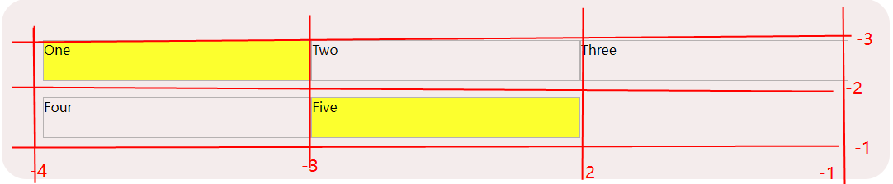<br>

## 4.3 z-index 控制层级

我们可以通过`grid-column-start/grid-column-end/ grid-row-start/grid-row-end`来设置网格的区域。则可能会导致两个网格区域进行重叠。此时可以通过`z-index`来控制显示层级。<br>

```javascript
.wrapper {
  border-radius: 30px;
  padding: 50px;
  background-color: #f5ecec;

  display: grid;
  grid-template-columns: repeat(3, 1fr);
  grid-template-rows: 50px 50px;

  // 创建网格间距
  grid-column-gap: 10px;
  grid-row-gap: 20px;
}
.box1 {
  grid-column-start: 1;
  grid-column-end: 4;
  grid-row-start: 1;
  grid-row-end: 3;
   z-index:2;
   background: #f1c1c1;
}

.box2 {
  grid-column-start: 1;
  grid-column-end: 2;
  grid-row-start: 2;
   grid-row-end: 4;
  background: #e7d6ad;
  z-index:1;
}

.wrapper>div, .wrapper2>div {
   border: 1px solid #b5b1b1;
}

<div class="wrapper">
   <div class="box1">One</div>
   <div class="box2">Two</div>
   <div>Three</div>
   <div>Four</div>
   <div class="box5">Five</div>
</div>
```

效果如下图所示：<br/>
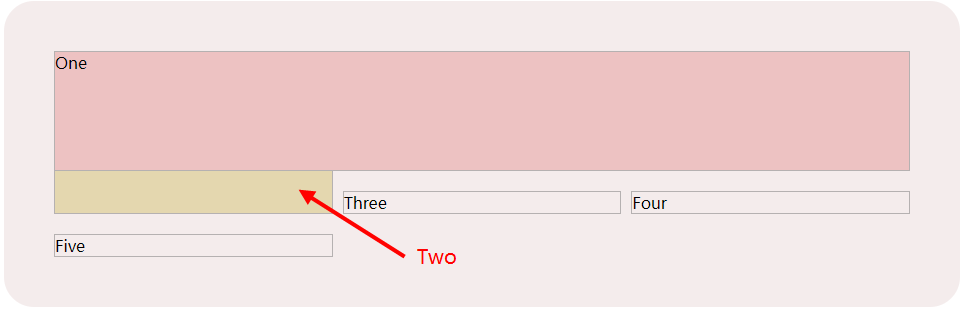<br/>

## 4.3 网格定位(position)

当为`box2`设置了区域，虽然 dom`box2`排在前面，但是会出现`box2`在`box3`的后面的这种情况。<br/>

我们也可以设置网格脱离文档流进行绝对定位。对设置网格区域进行绝对定位：<br/>

- 设置了网格区域，并且父级`wrapper`设置`position: relative`,按`网格区域左上定点`定位。
- 设置了网格区域，父级`wrapper`未设置`position: relative`,按`父级wrapper左上定点`定位。
- 脱离文档流的`box`大小不再按照设置的网格区域绘制，根据内容大小绘制。

```javascript
.wrapper {
  border-radius: 30px;
  padding: 50px;
  background-color: #f5ecec;

  display: grid;
  position: relative;
  grid-template-columns: repeat(3, 1fr);
  grid-template-rows: 50px 50px;

  // 创建网格间距
  grid-column-gap: 10px;
  grid-row-gap: 20px;
}
.box2 {
  grid-column-start: 1;
  grid-column-end: 2;
  grid-row-start: 2;
   grid-row-end: 4;
  background: #e7d6ad;
  z-index:1;
}
.box5 {
  grid-column-start: 2;
  grid-column-end: 4;
  grid-row-start: 2;
  grid-row-end: 4;
  position: absolute;
  top: 10px;
  left: 20px;
}
.wrapper>div, .wrapper2>div {
   border: 1px solid #b5b1b1;
}


<div class="wrapper">
   <div class="box1">One</div>
   <div class="box2">Two</div>
   <div>Three</div>
   <div>Four</div>
   <div class="box5">Five</div>
</div>
```

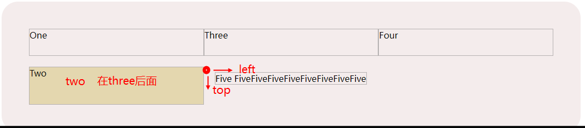<br/>

## 4.4 grid-area 区域命名

前面`grid-area`是通过设置四条线的位置来控制网格的区域，这里使用`区域命名`，结合`grid-template-area`指定区域位置。`区域命名`可以任意命名。例如`heaer/footer/sidbar/content`。<br>

```javascript
.wrapper {
  border-radius: 30px;
  padding: 50px;
  background-color: #f5ecec;
  display: grid;
  text-align: center;
  gap: 10px 20px;
 grid-template-areas: "header header header"
    "sidbar lnb lnb"
    "sidbar content content"
    ". footer footer";
}
.wrapper>div {
  background: #9aaceb;
}
.box1 {
  grid-area: header;
}
.box2 {
  grid-area: footer;
}
.box3 {
  grid-area: content;
}
.box4 {
  grid-area: sidbar;
}
.box5 {
  grid-area: lnb;
}

<div class="wrapper">
   <div class="box1">One</div>
   <div class="box2">Two</div>
   <div class="box3">Three</div>
   <div class="box4">Four</div>
   <div class="box5">Five</div>
</div>
```

#### 小知识点

- 在布局中的`.`符号，位置会被作为一个单元格。让布局更加灵活。
- `sidbar`放在了第二行与第三行，跨越了多个网格线。
- 可使用媒体查询，在不同的宽度下，定义不一样的布局。


## 4.5 自动外边距 auto(margin-left: auto使用)
当使用自动外边距，例如设置左右外边距都设置为 auto ，自动外边距能够消化掉全部的多余空间。当把两侧的外边距都设置为 auto 时，块元素就会被挤到中间，多余的空间则被留到两侧。<br>
```javascript
.wrapper {
  display: grid;
  grid-template-columns: repeat(3, 100px);
  grid-template-rows: repeat(3, 100px);
  gap: 10px;
  grid-template-areas:
    "a a b"
    "a a b"
    "c d d";
}
.item1 {
  grid-area: a;
  margin-left: auto;
}
.item2 {
  grid-area: b;
  margin-right: auto;
}
.item3 {
  grid-area: c;
}
.item4 {
  grid-area: d;
}
.wrapper >div{
  border: 1px solid;
}

<div class="wrapper">
  <div class="item1">Item</div>
  <div class="item2">Item 2</div>
  <div class="item3">Item 3</div>
  <div class="item4">Item 4</div>
</div>
```
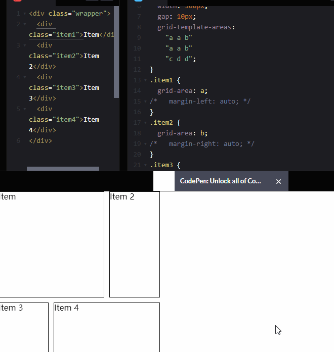<br>