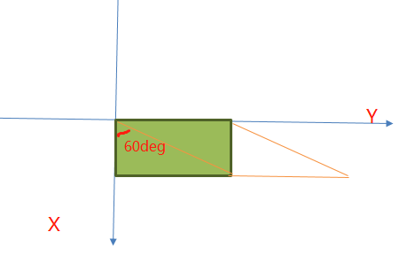

# 1. 动画
构成动画的最小独立单元分类：<br>
1. transform2d 或 transform3d（这类动画必须要事件触发）
1. animation
3. transition(这类动画必须要事件触发)<br>

animation(过度)：就是从a点 到 b点。就像坐过江轮船，是有时间的、连续的。一般针对常规的css属性。<br>
transform(变换)：就是几个固定的属性(旋转，缩放，偏移...)，效果使很干涩机械的旋转移动。与transition配合使用时，旋转等操作会很平滑<br>
animation(动画)： 最先安家于Safari浏览器，自成一家，与transition和transform有老死不相往来之感，但是要说单挑的话，animation要比transition厉害些。<br>

# 1.1 transform
transform： 将某个东西进行拉伸、压缩、旋转、偏移。<br>
电脑屏幕的XY轴跟我们平时所说的直角坐标系是不一样的<br>
<br>

## 1.1.1 skew() 扭曲变形(记得计算机的坐标系)
skewX(angle): 以X轴为基准(顺时针：负数，逆时针：正数)<br>
<br>
<br>

skewY(angle): 以Y轴为基准(顺时针：正数，逆时针：负数)<br>
<br>
<br>

skew(x-angle, y-angle)： 先按照x轴移动设置移动线，再按照y轴移动设置移动线，两者交汇处：即是最终结果<br>
<br>
可以推断出：<br>
- x轴移动`45deg`, y轴移动`45deg`,则移动的这两条线重叠，界面没有内容
- x轴移动`30deg`, y轴移动`60deg`, 则移动的这两条线重叠，界面没有内容
- x轴移动`30deg`, y轴移动`70deg`, 内容被翻面了<br>

<br>
```html
<style>
    .box {
        background-color: #bbbbbb;
        border: 1px solid red;
        width: 100px;
        height: 100px;
        margin-left: 40px;
        margin-top: 120px;
        display: inline-block;
    }
    .skew1 {
        transform: skew(30deg, 10deg);
    }
    .skew2 {
        transform: skew(30deg, 20deg);
    }
    .skew3 {
        transform: skew(30deg, 40deg);
    }
    .skew4 {
        transform: skew(30deg, 61deg);
    }
    .skew5 {
        transform: skew(40deg, 63deg);
    }
    .skew6 {
        transform: skew(60deg, 70deg);
    }
    </style>
    <body>
    <div class="box">阻止组织做 </div>
    <div class="box skew1">阻止组织做 </div>
    <div class="box skew2">阻止组织做 </div>
    <div class="box skew3">阻止组织做 </div>
    <div class="box skew4">阻止组织做 </div>
    <div class="box skew5">阻止组织做 </div>
    <div class="box skew6">阻止组织做 </div>
    </body>
```
## 1.1.2 rotate() 旋转(记得计算机的坐标系)
rotate(angle)： 正数为顺时针旋转，负数为逆时针旋转<br>
```html
<style>
    .box {
        background-color: #bbbbbb;
        border: 1px solid red;
        width: 200px;
        height: 100px;
        margin: 70px;
    }
    .rotate10 {
        transform: rotate(45deg);
    }
</style>
<body>
    <div class="box"></div>
    <div class="box rotate10"></div>
</body>
```
<br>

rotateX(), rotateY(), rotateZ(): 3d动画<br>
1. 仅x值的变化，使得动画在yz所形成的平面内的变化 :http://www.w3school.com.cn/tiy/c.asp?f=css_transform_rotatex
1. 仅y值的变化，使得动画在xz所形成的平面内的变化: http://www.w3school.com.cn/tiy/c.asp?f=css_transform_rotatey
1. 仅z值的变化，使得动画在xy所形成的平面内的变化: 
1. x,y值同时变化，形成在x轴上的变化
1. x,z值同时变化，则形成y轴上的变化
1. y,z值同时变化，则形成x轴上的变化
1. x,y,z值都变化，则形成的是关于控件中一点上(0,0,0)做变化

## 1.1.3 缩放 scale()
### scale()
没有x,y,z轴，而是按照水平，垂直方向进行设置。实例： http://www.w3school.com.cn/tiy/c.asp?f=css_transform_scale<br>
- 一个参数时：表示水平和垂直同时缩放该倍率
- 两个参数时：第一个参数指定水平方向的缩放倍率，第二个参数指定垂直方向的缩放倍率。
```css
/* 水平，垂直方向都缩小一倍 */
transform: scale(0.5);
/* 水平缩小一倍，垂直放大1倍 */
transform: scale(0.5, 2);
```
### scale3d(x, y, z)

## 1.1.4 移动 translate（translateX, translateY）
没有x,y,z轴，而是按照水平，垂直方向进行设置。<br>
- 一个参数时：表示水平方向的移动距离；
- 两个参数时：第一个参数表示水平方向的移动距离，第二个参数表示垂直方向的移动距离。
```css
/* 水平，垂直方向都移动45px */
transform: translate(45px);
/* 水平方向移动45px，垂直方向移动40px */
transform: translate(45px, 40px)
```
- translate3d(x, y, z)
```html
<style type="text/css">  
        body{margin: 0}
        div{width: 60px;height: 60px;background-color: skyblue;}
        .moved{transform: perspective(500px) translate3d(20px, 0px, 0px);background-color: pink;transition: 0.3s;  }
        .moved:hover{transform: perspective(500px) translate3d(20px, 0px, 174px);}          
    </style>        
</head>          
<body>  
    <div>Static</div>
    <div class="moved">Moved</div>
    <div>Static</div>
</body>          
```
# 1.2 transation
这是在执行过程中，生命关键帧的动画。可以一旦元素的属性发生变化，就形成一个动画。<br>
- transition-property: width; => 就是指只指定with属性参与过度
- transition-duration: 1ms; => 只过度持续时间
- transition-timing-function: ease; => 指定过渡动画缓动类型(有ease | linear[线性过度] | ease-in[由慢到块] | ease-out[由快到慢] | ease-in-out[慢到快再到慢] | cubic-bezier())
- transition-delay: 1ms; => 延缓过度时间。<br>

下面的例子，ease相关的都会同时到达，但是过程中速度不一样。<br>
<br>
```html
<style>
    .trans_box {
        padding: 20px;
        background-color: #f0f3f9;
        *zoom:1;
    }
    .trans_box:hover .trans_list {
        margin-left:89%;
        background: #beceeb;
        color: #333;
        border-radius: 25px;
        transform: rotate(360deg)
    }
    .trans_list {
        width: 90px;
        height: 64px;
        margin:10px 0;
        background-color:#486AAA;
        color:#fff;
        text-align:center;
    }
    .ease {
        transition: all 4s ease;
    }
    .ease_in {
        transition: all 4s ease-in;
    }
    .ease_out {
        transition: all 4s ease-out;
    }
    .ease_in_out {
        transition: all 4s ease-in-out;
    }
    .ease_linear {
        transition: all 4s linear;
    }
</style>
<body>
    <div id="transBox" class="trans_box">
        <div class="trans_list ease">ease</div>
        <div class="trans_list ease_in">ease-in</div>
        <div class="trans_list ease_out">ease-out</div>
        <div class="trans_list ease_in_out">ease-in-out</div>
        <div class="trans_list linear">linear</div>
    </div>
</body>
```
# 1.3 animation
通过@keyframes来设置关键帧，在每个关键帧中设置该帧动画中某个元素的一个或几个属性的变化。
- animation-name: 通过@keyframes定义的动画名称
- animation-duration： 持续时间
- animation-timing-function： ease; => 指定过渡动画缓动类型(有ease | linear[线性过度] | ease-in[由慢到块] | ease-out[由快到慢] | ease-in-out[慢到快再到慢] | cubic-bezier())
- animation-delay： 延迟多久执行
- animation-iteration-count：重复次数
- animation-direction： normal: 正常方向重复播放， alternate: 正向/反向/正向/反向进行重复播放<br>
```html
<style>
    .box {
        background-color: #bbbbbb;
        border: 1px solid red;
        margin: 50px;
        width: 100px;
        height: 100px;
        animation: testAnimation 10s ease-in-out  normal;
        
    }
    @keyframes testAnimation {
        0% {
            transform: rotate(0)
        }
        5% {
            transform: rotate(45deg)
        }
        50% {
            transform: rotate(0);
            margin-left: 600px;
        }
        100% {
            transform: rotate(360deg);
            margin-left: 50px;
            transition: all 5s ease;
        }
    }
</style>
<body>
    <div class="box"> </div>
</body>
```
# 2 按钮动画
<br>
```html
<style>
    /* 按钮最终大小。宽20，高24 */
    .menu-outer {
        position: relative;
        display: inline-block;
        margin: 30px;
        width: 20px;
        height: 24px;
        cursor: pointer;
    }
    .menu-outer:hover .menu::before {
        transform: translateY(8px) rotate(45deg);
    }
    .menu-outer:hover .menu::after {
        transform: translateY(-8px) rotate(-45deg);
    }
    .menu-outer:hover .menu {
        background-color: transparent;
    }
    .menu {
        position: absolute;
        top: 50%;
        left: 50%;
        width: 20px;
        height: 2px;
        padding: 8px 0;
        /* 这里最终的内容只剩下了2px高 */
        background-clip: content-box;
        background-color: #585247;
    }

    .menu::before, .menu::after {
        position: absolute;
        left: 0;
        display: inline-block;
        width: 100%;
        content: '';
        height: 2px;
        background: #585247;
        transition: transform 0.3s, background-color 0.3s;
    }
    .menu::before {
        top: 0;
    }
    .menu::after {
        bottom: 0;
    }
    </style>
    <body>
        <div class="menu-outer">
            <span class="menu"></span>
        </div>
    </body>
```
