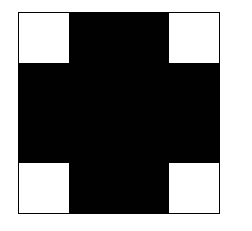

# 1. 什么是background
background是用于集中定义各种背景属性。例如背景的color, size, origin,size,repeat等。其中的属性顺序可以按任意顺序放置。<br>
| 参数  | 说明 | 实例   |
|-------|-------|-------|
| background-attachment| 决定背景图像的位置是在视口内固定, 或者随着包含它的区块滚动| fixed: 不管`内容窗口`和`body`滚动，相对`内容窗口`位置固定不动<br>local:不管`内容窗口`和`body`滚动，都随着`内容窗口`位置滚动<br>scroll:`内容窗口`滚动，相对`内容窗口`不动。`body`滚动，相对`内容窗口`滚动。 |
| background-clip|控制背景的渲染区域，控制裁减背景大小，在裁减的范围区域外不被显示|border-box:背景延伸至边框外沿<br>padding-box:背景延伸至内边距（padding）外沿。不会绘制到边框处<br>content-box: 背景被裁剪至内容区（content box）外沿。<br>text: 背景被裁剪成文字的前景色。|
| background-image | 设置一个或多个背景图片。设置背景颜色，使用`,`隔开| background-image: url("../../media/examples/lizard.png"),url("../../media/examples/star.png");|
| background-origin | 指定background-position属性的相对位置|border-box: 背景图片的摆放以 border 区域为参考<br>padding-box:背景图片的摆放以 padding 区域为参考<br>content-box: 背景图片的摆放以 content 区域为参考|
| background-position|设置背景图片的初始位置。这个位置是相对于`background-origin`定义 的位置图层的。|background-position: 10px;:指定一个值：x为10px, y为center。<br>background-position: bottom 10px right 20px: 指定4个值，为离底部偏移10px，离右边偏移20px<br>|
| background-color | 设置背景颜色| background-color: red;|   
| background-repeat|沿着水平轴，垂直轴，两个轴重复。|repeat:此属性用于水平和垂直重复背景图像。如果最后的图像不适合浏览器窗口，则会被剪裁<br>repeat-x: 水平重复背景图像<br>repeat-y: 背景图像仅垂直重复<br>no-repeat:不重复背景图像。它仅显示背景图像一次<br>space:图像会尽可能得重复，但是不会裁剪.除非只有一个图像能被无裁剪地显示。只在一种情况下裁剪会发生，那就是图像太大了以至于没有足够的空间来完整显示一个图像|
## 1.1 background-attachment
```javascript

.background {
  width: 300px;
  height:200px;
  border: 1px solid;
  overflow: scroll;
  background-image: url('https://t7.baidu.com/it/u=1595072465,3644073269&fm=193&f=GIF');
  word-break: break-word;
  background-size: 100px auto;
  background-repeat: no-repeat;
  background-attachment: local;
/*   background-attachment:scroll; */
/*   background-attachment: fixed; */
}
body {
  height: 1000px;
}

<div class="background fixed">123451234512345123452341234512345123451234123451234512345123452341234512345123451234523451234512345123451234123451234512345123452341234512345123451234123451234512345123452341234512345123451234523451234512345123451234523455523451234512345123451234523455523455523451234512345123451234523455123451234123451234512345123452341234512345123451234523451234512345123451234523455523451234512345123451234523455523455523451234512345123451234523455</div>
```
这里滚动有两个地方滚动，一个是`内容容器`滚动，一个是页面`body`滚动。
#### local
`local` ：不管是`容器滚动`还是`body`滚动，都会随着内容滚动而滚动。<br>
<br>
#### scroll
`scroll`: `容器滚动`时，背景图片相对内容固定。而`body`滚动时，随着内容一起滚动。相当内容内部不固定。<br>
<br>
#### fixed
`fixed`: 不管是`容器滚动`还是`body`滚动，相对内容的内置来说，都是固定的。<br>
<br>

## 1.2 background-clip
控制背景的渲染区域。设置元素的背景（背景图片或颜色）是否延伸到边框、内边距盒子、内容盒子下面。<br>
```javascript
.wrapper {
 display:flex;
 border: 1px solid;
}
.box {
  height: 100px;
  width: 100px;
   border: .8em darkviolet;
  border-style: dotted double;
  background-size: 100px;
  background-repeat: no-repeat;
  margin: 30px;
  padding: 10px;
  background: linear-gradient(60deg, red, yellow, red, yellow, red);
}
.border {
 background-clip: border-box;
}
.padding {
  background-clip: padding-box;
}
.content {
  background-clip: content-box;
}
.text {
  background-clip: text;
 -webkit-background-clip: text;
  color: rgba(0,0,0,.2);
}

<div class="wrapper">
<div class="box border"> a</div>
<div class="box padding"> b</div>
<div class="box content"> c</div>
<div class="box text"> d</div>
</div>

```


## 1.3 设置多个img背景background-image
设置多个背景图片时，以`Z`轴方向堆叠的方式，先指定的图像会在之后指定的图像上面进行绘制。因此第一个图片时最接近用户的图像。<br>
在未指定`backgorund-clip`与`background-origin`时，border绘制在所有图像上面，`background-color`绘制在所有图像下面。<br>
```javascript
.wrapper {
 background-image: url(https://encrypted-tbn0.gstatic.com/images?q=tbn:ANd9GcRqgOwP5hYDSju7SF-j6pSVuarSFPzzotxD_Q&usqp=CAU), url(https://img.win3000.com/m00/d6/f0/39de3b0c924e419833db0c8aab402dd6.jpg);
  background-position: center, top;
  background-repeat: no-repeat, no-repeat;
  background-size: contain, cover;
  height: 300px;
  width: 300px;
}
<div class="wrapper">

</div>
```
<br>

## 1.4 background-origin
当使用 background-attachment 为 `fixed` 时，该属性将被忽略不起作用。<br>
这里`background-origin`与`background-attatchment`的效果差不多，但是他们的原理有一定的区别：<br>
- background-origin: 定义的是背景位置（background-position）的起始点
- background-attatchment: 是对背景（图片和背景色）的切割<br>

```javascript
.wrapper {
 display:flex;
 border: 1px solid;
}
.box {
  height: 100px;
  width: 100px;
  border: .8em dotted;
  margin: 30px;
  padding: 10px;
  background: ;
  background: #ffff00 url(https://t7.baidu.com/it/u=1595072465,3644073269&fm=193&f=GIF) no-repeat;
  background-size: 50px auto;

}
.border {
 background-clip: border-box;
background-position: 10px 10px;
}
.padding {
  background-clip: padding-box;
}
.content {
  background-clip: content-box;
}
.border2 {
 background-origin: border-box;
}
.padding2 {
  background-origin: padding-box;
}
.content2 {
  background-origin: content-box;
}

.position {
  background-position: 20px 20px;
}

<div class="wrapper">
<div class="box border"> a</div>
<div class="box padding"> b</div>
<div class="box content"> c</div>
</div>

<div class="wrapper">
<div class="box border2"> a</div>
<div class="box padding2"> b</div>
<div class="box content2"> c</div>
</div>

<div class="wrapper">
<div class="box border2 position"> a</div>
<div class="box padding2 position"> b</div>
<div class="box content2 position"> c</div>
</div>


```
<br>

# 2.background 渐变
background渐变分为4类：线性渐变 、径向渐变 、角向渐变、重复渐变。

## 2.1 线性渐变linear-gradient() (默认从上往下)
用于创建多种颜色`线性渐变`的图片。<br>
- linear-gradient(45deg, blue, red): 渐变轴为45度，从蓝色渐变到红色
- linear-gradient(to left top, blue, red)：从右下角 -> 左上角，从蓝色渐变到红色
- linear-gradient(0deg, blue, green 40%, red)： 从下往上，0%->40%从蓝色变为绿色，40%->100%从绿色渐变到红色
- linear-gradient(red, orange, yellow, green, blue) 等价 linear-gradient(red 0%, orange 25%, yellow 50%, green 75%, blue 100%);
- linear-gradient(red 10%, 30%, blue 90%)：一般默认渐变`中点`为50%，这里设置了渐变`中点`。从10%->90%,由红色渐变为蓝色，`中点`为10%<br>
以上的效果图：<br>
<br>

### 2.1.1 to关键字定义方向
| 参数  | 说明 | 实例   |
|-------|-------|-------|
| to top | 从下往上 | linear-gradient(to top, blue, red) |
| to bottom | 从上往下 | linear-gradient(to bottom, blue, red) |
| to right | 从左往右 | linear-gradient(to right, blue, red) |
| to left | 从右往左 | linear-gradient(to left, blue, red) |
|to right bottom|从左上角到右下角|linear-gradient(to right bottom, blue, red)|
| to right top | 从左下角到右上角 | linear-gradient(to right top, blue, red)|
| to left bottom| 从右上角到左下角 | linear-gradient(to left bottom, blue, red)|
| to left top| 从右下角到左上角 | linear-gradient(to left top, blue, red)|

参考效果图：<br>
<br>


### 2.1.2 使用角度定义方向
一整个平面角度为360度。可以使用角度来代替预定方向。<br>

<br>

| 参数  | 说明 | 实例   |
|-------|-------|-------|
| 0deg | 从下往上 | linear-gradient(0deg, blue, red) |
| 180deg | 从上往下 | linear-gradient(180deg, blue, red) |
| 90deg| 从左往右 | linear-gradient(90deg, blue, red) |
| 270deg | 从右往左 | linear-gradient(270deg, blue, red) |
|135deg|从左上角到右下角|linear-gradient(135deg, blue, red)|
| 45deg | 从左下角到右上角 | linear-gradient(45deg, blue, red)|
| 225deg | 从右上角到左下角 | linear-gradient(225deg, blue, red)|
| 315deg| 从右下角到左上角 | linear-gradient(315deg, blue, red)|

<br>

### 2.1.3 渐变技巧学习

#### 渐变到透明色
<br>

如果要实现图中的效果，相当于从做往右，从透明色渐变为白色，实现一个遮罩效果。css参考下图。

```javascript
background: linear-gradient(90deg, transparent, #fff);
// 或者
background: linear-gradient(to right, transparent, #fff);
```

#### 渐变色实现三角形
上面提到，可以自定义设置不同百分比段的颜色，可以利用这个特点，从一个颜色直接过渡到另外一个颜色。
```javascript
.wrapper {
  height: 100px;
  width: 100px;
  margin: 30px;
  border: 1px solid;
  background: linear-gradient(to top right, red  0%, red 50%, transparent  50%, transparent 100%);
}
<div class="wrapper">

</div>
```

#### 渐变色叠加

下图实现叠加效果步骤：<br>
- 填充四组背景，每一组都有backgorund, size, position, repeat。因为size是一样的，因此可以省略写成一组。
linear-gradient(to top left, #fff 20px, deeppink 0)：表示颜色渐变方向为左上角，deepink从0%开始（相当于全部都是deepink），但是白色从起始位置渲染了`20px`。
```javascript
.wrapper {
  height: 100px;
  width: 100px;
  margin: 30px;
  border: 1px deeppink;
  background: 
    linear-gradient(to top left, #fff 20px, deeppink 0),
    linear-gradient(to bottom right, #fff 20px, deeppink 0),
    linear-gradient(to bottom left, #fff 20px, deeppink 0),
    linear-gradient(to top right, #fff 20px, deeppink 0);
  
  background-size: 50% 50%;
  background-position: bottom right, top left, top right, bottom left;
  background-repeat: no-repeat;
}
<div class="wrapper">
</div>
```
<br>

#### repeating-linear-gradient 重复渐变
用于创建重复线性渐变的imgage。与`linear-graient`的使用方式一致。只是他会在在所有方向上重复渐变用以覆盖容器。<br>

```javascript
.wrapper {
  height: 100px;
  width: 200px;
  margin: 30px;
  border: 1px deeppink;
  background:repeating-linear-gradient(135deg, black 0%, black 10%, white 10%, white 20%);
  // background:repeating-linear-gradient(135deg, black 0, black 25px, white 25px, white 45px);
}

<div class="wrapper">
</div>
```
方向朝右下角，10%范围为黑色，10%~20%为白色。通过重复该样式，变成了斑马线。<br>
<br>

## 2.2 径向渐变 radial-gradient() ，左上角坐标为(0,0)
该`css函数`也是为创建一个图像，该图像由`原点辐射`，由多种颜色进行渐进过度，组成原型或者椭圆形的渐进色图片。`径向渐变`通过指定`渐变的中心`（0% 椭圆所在的位置）和`结束形状`（100% 椭圆）的大小和形状来指定。<br>
```javascript
// 语法
background-image: radial-gradient(shape size at position, start-color, ..., last-color);

// 从容器中心开始渐变，红色开始，过度到蓝色，最后变成绿色
background-image: radial-gradient(circle at center, red 0, blue, green 100%)
```
### 2.2.1 参数详解
- shape: 默认ellipse，参数为circle | ellipse
- position: 默认为中心。参数与backgorund-posiition 相识。
- size,定义渐变的大小，接收4个参数。<br>
| 参数  | 说明 | 默认值|
|-------|-------|-------|
| shape | 圆的类型:<br> ellipse: 指定椭圆的径向渐变 <br> circle: 指定圆形的径向渐变 |ellipse|
| position | 定义渐变的位置：<br> center: 设置中间为径向渐变圆心的纵坐标值。<br>top: 设置顶部为径向渐变圆心的纵坐标值<br>bottom：设置底部为径向渐变圆心的纵坐标值| center |
| size| 定义渐变的大小:<br> farthest-corner: 指定径向渐变的`半径长度`为从`圆心到离圆心最远的角`<br> closest-side:指定径向渐变的`半径长度`为从`圆心到离圆心最近的边`<br> closest-corner:指定径向渐变的`半径长度`为从`圆心到离圆心最近的角`<br>farthest-side ：指定径向渐变的`半径长度`为从`圆心到离圆心最远的边`|farthest-corner|
|start-color, ..., last-color | 用于指定渐变的起止颜色。|

对于参数中的size,可能我的理解力有问题，理解半天，终于弄懂了。以以下图例来解释可能会更清除一点。<br>
<br>

### 2.2.2 实例解析
理解了参数，接下来看实例：<br>
```javascript
.wrapper {
 display:flex;
 border: 1px solid;
}
.box {
  height: 100px;
  width: 200px;
  border: 1px solid;
  margin: 30px;
}
.circle {
  background: radial-gradient(circle at center, red 0, blue, yellow 100%)
}
.ellipse {
  background: radial-gradient(ellipse at center, red 0, blue, yellow 100%)
}
.farthest-corner {
  background: radial-gradient(farthest-corner at 20px 20px, red 0, blue, yellow 100%)
}
.closest-side {
   background: radial-gradient(closest-side at 20px 20px, red 0, blue, yellow 100%)
}
.closest-corner {
  background: radial-gradient(closest-corner at 20px 20px, red 0, blue, yellow 100%)
}
.farthest-side {
  background: radial-gradient(farthest-side at 20px 20px, red 0, blue, yellow 100%)
}


<div class="wrapper">
<div class="box circle"></div>
<div class="box ellipse"></div>
</div>
<div class="wrapper">
<div class="box farthest-corner"></div>
<div class="box closest-side"></div>
<div class="box closest-corner"></div>
<div class="box farthest-side"></div>
</div>
```
<br>

### 2.2.3 渐变技巧学习
在`linear-gradient`中的技巧也能够适用到`radial-gradient`中，这里再学习学一些其他的小技巧。

#### 消灭衔接处的锯齿
在使用渐变色过度时候，衔接处不能直接过度，需要留一定的缝隙，才能让过度变得平滑。<br>
```javascript
.wrapper {
 display:flex;
 border: 1px solid;
}
.box {
  height: 200px;
  width: 200px;
  border: 1px solid;
  margin: 30px;
}
.zigzag {
  background: radial-gradient(red 0, red 50%,  yellow 50%)
}
// yellow从51%开始，未产生锯齿状
.smooth {
   background: radial-gradient(red 0, red 50%,  yellow 51%)
}
<div class="wrapper">
<div class="box zigzag"></div>
<div class="box smooth"></div>
</div>
```
<br>

#### 文字下划线波浪效果
自己实现步骤：<br>
- 第一步：绘制红色和绿色的圆
- 绿色圆圈网上移动，坐标为`20px -15px`, 红色圆圈往下移动，坐标为`20px 55px`。相对圆中心是对称的。
- 通过`background-position 的y轴`移动上下间距，让两个图片变成一个椭圆。
- 通过`background-position的x轴`移动左右间距，将薄凉链接成功<br>

<br>
```javascript
.wrapper {
  position: relative;
  height: 40px;
  width:200px;
  margin: 30px auto;
  transform: scale(2);
  &::after, &::before {
    position: absolute;
    content: '';
    bottom: 0;
    left: 0;
    top:  0;
    right: 0;
    width: 100%;
  }

   &::after {
    background-image:  radial-gradient(circle at 20px -15px, transparent 18px,  red 18px, red 19px, transparent 19px), radial-gradient(circle at 20px 55px, transparent 18px,  green 18px, green 19px, transparent 19px);
    background-size: 40px 40px;
    background-position: -10px -19px, 10px 22px;
  }
// 与上面是等价的。
//  &::after {
//     background-image: radial-gradient(circle at 20px -15px, transparent 18px,  red 18px, red 19px, transparent 19px);
//     background-size: 40px 40px;
//     background-position: -10px -19px;
//   }
//  &::before {
//     background-image: radial-gradient(circle at 20px 55px, transparent 18px,  green 18px, green 19px, transparent 19px);
//     background-size: 40px 40px;
//    background-position: 10px 22px;
//   }
}

<div class="wrapper">
 你好呀，这里渐变实现  
</div>
```
<br>


我们波浪线准备好了，想要添加一个滚动的效果。其实横向滚动，也就是`x轴`的变更。而变更的间距就是波浪的宽度`40px`。因此从`红色`波浪从`-10->30`,`绿色`波浪从`10=>40`。<br>

```javascript
.wrapper::after  {
       animation: waveFlow 1s infinite linear;
}
@keyframes waveFlow {
    from { background-position-x: -10px, 10px; }
    to { background-position-x: 30px, 50px; }
}
```
<br>

#### 波浪效果实现
波浪原理分析：<br>
- 首先绘制小圆，小圆的大小是`20 * 20`， 坐标为 `-5px 10px`。再`反向`绘制大圆，大源的大小为`20 * 40`， 坐标为`15px 10px`。
- 两个圆的横向坐标都为`10px`，因此`一个大圆`图片大小 为 `两个小圆`的图片大小
- 大圆绘制时，圆圈占用`20px`， 间隙占用`20px`，而这个间隙刚好就是`小圆`完整显示的位置<br>

<br>
```javascript
.wrapper {
  position: relative;
  height: 150px;
  width: 400px;
  margin: 30px;
  background-image: linear-gradient(90deg, #945700, #f49714 );
  background-color:red;
  &::after, &::before {
    position:absolute;
    content: '';
    top: 0;
    bottom:0;
    right:0;
  }

  &::after {
    width: 10px;
    background-image: radial-gradient(circle at -5px 10px, transparent 12px, #fff 13px, #fff 0px);
    background-position: 0 15px;
    background-size: 20px 20px;
  } 
  &::before {
    width: 15px;
    // transparent 13px: 用于消除上面说的锯齿问题
    background-image: radial-gradient(circle at 15px 10px, #fff 12px, transparent 13px, transparent 0px);
    background-size: 20px 40px;
    background-position: 0 15px;
  }
}

<div class="wrapper"></div>
```
<br>

#### repeating-radial-gradient() 重复渐变
```javascript
.wrapper {
    display: flex;
}
.box {
  height:200px;
  width: 200px;
  margin: 30px;
  border:1px solid;
  border-radius: 100px;
}
.radial {
    background: radial-gradient(yellow 0 33px, green 33px 66px, red 66px 100px) ;
}
.repeat-radial {
     background: repeating-radial-gradient(yellow 0 10px, green 10px 20px, red 20px 30px) ;
}

<div class="wrapper">
     <div class="box radial"></div>
     <div class="box repeat-radial"></div>
</div>
```
<br>

## 2.3 conic-gradient() 角向渐变（圆锥渐变）
`conic-gradient()`函数也是创建背景图像，渐变颜色围绕一个`中心点`旋转(径向渐变是从中心点往外发射)。渐变的颜色断点通过`angle`来指定。<br>
<br>
语法
```css
background-image: conic-gradient([from angle] [at position,] color degree, color degree, ...);

```
- 起始位置，图形正中心
- 默认渐变角度从`0deg`，垂直与圆心开
- 渐变方向按照顺时针方向绕着中心渐变<br>

### 2.3.1 参数详解

**1turn = 360deg = 400grad**
- 梯度（grad）: 一个圆公400grad
- 圈（turn）: 一个圆1turn
- 弧度（rad）: 一个圆2π弧度。1rad=180°/π≈57.3°<br>


| 参数  | 说明 | 默认值|
|-------|-------|-------|
| from angle | 非必填，起始角度。 |默认从 0deg开始渐变|
| at position | 非必填，中心位置。默认居中 | center|
| color degree, ..., color degree | 角渐变断点。该值包含一个颜色值，后跟一个可选的停止位置（ 0 到 360 之间的度数或 0% 到 100% 之间的百分比）。 |（yellow 45deg） 或者（yellow 15%）。<br>一圈360度或者100%<br> |

### 2.3.2 实例解析

实例分析各种类型：
```javascript
.wrapper, .wrapper2 {
 display:flex;
 border: 1px solid;
}
.box {
  height:100px;
  width: 100px;
  border: 1px solid;
  margin: 30px;
  color: red;
}
.default-angle {
 // 默认均分范围。
  background: conic-gradient(red, yellow, blue);
 // 等价与：
 // background: conic-gradient(red 0deg, yellow 180deg, blue 360deg);
}
.test-angle {
  // 0角度为红色，90deg为黄色，以0->90deg的方向，从红色到黄色进行渐变。其他角度渐变类似。
    background: conic-gradient(red 0deg, yellow 90deg, blue 180deg, green 270deg, pink 360deg);
}
.custom-center {
    // 0deg->40grad 为 红色，以80grad位置为中心点渐变。
     background:conic-gradient(red 40grad,  80grad, blue 360grad);
}
.turn {
    // turn让具体某一小圈使用同一个颜色
     background: conic-gradient(#fff 0.09turn, #bbb 0.09turn, #bbb 0.27turn, #666 0.27turn, #666 0.54turn, #000 0.54turn);
    // 等价：
    // background: conic-gradient(#fff 0turn 0.09turn, #bbb 0.09turn 0.27turn, #666 0.27turn 0.54turn, #000 0.54turn 1turn);
}
.rad {
    // 颜色断点应按升序排列。值较低的后续颜色断点将覆盖上一个颜色断点的值，从而创建硬过渡。因此红色变成了不是渐变的颜色。1rad=180°/π≈57.3°
    background: conic-gradient(red .8rad, yellow .6rad, blue 1.3rad);
    // 等价
    // background: conic-gradient(red 46.84deg, yellow 34.38deg, blue 74.49deg);
}
.from {
    // 从40deg开始，由黄色渐变到黑色
    background: conic-gradient(from 40deg, yellow, #000);
}
.move-center {
    // 以10px, 50px为中心，角度以40deg开始，由黄色渐变到黑色
    background: conic-gradient(from 40deg at 10px 50px, yellow, #000);
}
.gradient {
    border-radius: 100px;
    // 40度为红色，135度范围为橙色，剩下的为黄色
    background: conic-gradient(red 0.125turn, orange 0.125turn, orange 0.375turn, yellow  0.375turn, yellow 1turn)
}
.block {
    // 通过将背景设置位4块，2块白色，2块黑色。再利用背景 大小设置位25px。再repeat image显示，变成棋盘格。
    background-image: conic-gradient(#fff 90deg, #000 90deg, #000 180deg, #fff 180deg, #fff 270deg,#000 270deg) ;
    background-size: 25px 25px;
}

 单位实例
<div class="wrapper">
<div class="box default-angle"></div>
<div class="box test-angle"></div>
<div class="box custom-center"></div>
<div class="box turn"></div>
<div class="box rad"></div>
</div>

<div class="wrapper2">
<div class="box from">from</div>
<div class="box move-center">修改中心</div>
<div class="box gradient">不渐变</div>
<div class="box block">棋盘格</div>
</div>
```
<br>

### 2.3.3 渐变技巧学习

#### 颜色表盘实现
```javascript
.box {
  height:200px;
  width: 200px;
 border-radius: 100px;
  margin: 30px;
  background: conic-gradient(red, yellow, lime, aqua, blue, magenta, red);
}
<div class="box"></div>
```
 <br>

#### 斜向棋盘实现
-45deg角度开始，作为起始位置。先绘制黑色、白色、黑色、白色 4个方格子。然后将大小设置位`20px 20px`。重复渲染即可。
```javascript
.box {
  height:200px;
  width: 200px;
  margin: 30px;
  border:1px solid;
  background: conic-gradient(from -45deg,#000 90deg, #fff 90deg, #fff 180deg, #000 180deg, #000 270deg, #fff 270deg, #fff 360deg);
    background-size: 20px 20px;
}
<div class="box"></div>
```
<br>

#### repeating-conic-gradient 重复渐变

```javascript
.wrapper {
    display: flex;
}
.box {
  height:200px;
  width: 200px;
  margin: 30px;
  border:1px solid;
  border-radius: 100px;
}

.conic {
    background: conic-gradient(yellow 0 120deg, green 120deg 240deg, red 240deg 360deg) ;
}
.repeat-conic {
  background: repeating-conic-gradient(yellow 0 15deg, green 15deg 30deg, red 30deg 45deg);
}

<div class="wrapper">
    <div class="box conic"></div>
    <div class="box repeat-conic"></div>
</div>
```
<br>

# 2.4 图像实操

## 2.4.1 绘制十字架2中方式
- class `.repeat-conic`: 绘制出一个小正方形。然后利用背景图片的repeat属性，向左右移动正方形的一半，就出现了4个小正方形。
- class `.conic`: 利用两个背景图片，修改图片的大小，并居中显示。

```javascript
.wrapper {
  height:200px;
  width: 200px;
  margin: 30px;
  border:1px solid;
}
.repeat-conic {
    background-image: conic-gradient(from 270deg at 100px 100px, #fff 0 90deg, #000 90deg 360deg);
    background-position:-50px -50px;
}
.conic {
    background-image: conic-gradient(#000, #000), conic-gradient(#000, #000);
    background-size:  100% 50%, 50% 100%;
    background-repeat: no-repeat;
    background-position: center, center;
}


<div class="wrapper repeat-conic"></div>
<div class="wrapper conic"></div>
```

<br>

## 2.4.2 repeat酷炫图片
利用小角度（例如0.1deg）制造酷炫图片。
```javascript
.wrapper {
  height:200px;
  width: 200px;
  margin: 30px;
  border:1px solid;
}
.repeat-conic {  
    background-image: repeating-conic-gradient(#fff, #000, #fff 20deg);
}
.repeat-little {  
    background-image: repeating-conic-gradient(#fff, #000, #fff 0.1deg);
}
.repeat-radial {
    background-image: repeating-radial-gradient(#fff, #000, #fff 3px);
}
.repeat-radial-coordinate {
    background-image: repeating-radial-gradient(circle at 40px 60px,red, yellow, lime, aqua, blue, magenta, red, red 3px);
}
.repeat-radial-coordinate-little {
    background-image: repeating-radial-gradient(circle at 40px 60px,red, yellow, lime, aqua, blue, magenta, red, red 0.1px);
}

<div style="display: flex">
<div class="wrapper repeat-conic"></div>
<div class="wrapper repeat-radial"></div>
<div class="wrapper repeat-little"></div>
<div class="wrapper repeat-radial-coordinate"></div>
<div class="wrapper repeat-radial-coordinate-little"></div>
</div>

```
 <br>

# 3. 小结

在绘制过程中，可以有以下技巧可以使用：<br>
- 渐变色可以是透明的
- 渐变时可以直接一个颜色变成另外一个颜色，不需要有过度的效果
- 渐变可以多层叠加，也可以通过在一个背景上设置多个background-image
- 通过预留衔接空间消除锯齿问题
- repeating-*-gradient：可以实现片段的重复
- 利用position的移动与repeat的特性，可以实现特殊的图形
- 利用小间距（例如最后一个例子 0.1px），绘制出奇异的图案<br>
