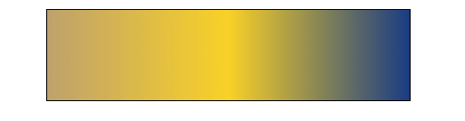

继上一篇background学习后，现在来继续深入background的动画相关的实践例子。<br>

有很多属性支持动画，例如`color`, `height`,` width`。他们在MDN中可以查阅到动画的支持情况。<br>
<br>

# 1. background-image背景动画渐变方式
background-image不支持CSS3的transition,因此`css3 gradient`渐变作为背景图片的时候，是不会有任何过渡效果。<br>
```javascript
.gradient-container {
  margin:40px auto;
  width: 400px;
  height: 100px;
  border: 1px solid;
  background-image:linear-gradient(to right, olive, green);
  transition:background-image 0.5s linear;
}
.gradient-container:hover  {
   background-image:linear-gradient(to right, green, yellow);
}
<div class="gradient-container">
</div>
```
<br>

但是我们可以从其他3方面来实现背景动画：<br>
- `background-position`：通过背景的移动模拟渐变动画
- `background-size`: 通过背景大小的缩放过程来模拟渐变动画
- `transform`: 通过外层的大渐变图形的移动（transform）来模拟渐变动画<br>

## 1.1 background-position 渐变动画

- 使用线性渐变，将厌恶从红橙黄绿进行渐变
- 将backgorund-size 设置为普通的两倍大，box为`400 * 100`，那么背景为`800 * 200`
- 当hover放上去后，`background-positoin`从最左侧开始变为`100% 0`, 那么刚好将 `400*100`的背景移动到左边，显示宽度为`401到800`的背景
- MDN 中`background-positoin`支持动画，利用transition属性，让`background-positoin`在`0.5s`内实现<br>

```javascript
.gradient-container {
  margin:40px auto;
  width: 400px;
  height: 100px;
  border: 1px solid;
 background: linear-gradient(to right, red, orange, yellow, green);
 background-size: 200%;
 transition: background-position .5s;  
 background-position: left left;
}
.gradient-container:hover  {
   background-position: 100% 0;
}

<div class="gradient-container">
</div>
```
<br>

## 1.2 background-size 渐变动画

- 动画变化在 `backgroud-size`由 `300%` => `100%` => `300%`进行切换
- 配合设置`background-positoin: 100% 0` 的起始位置，因为默认位置为`0,0`,如果不设置，则 `0->100%`内不会有动画效果。<br>

<br>

```javascript
div {
    position: relative;
    width: 300px;
    height: 100px;
    margin: 20px auto;
    background: linear-gradient(90deg,  #ffc700 0%, #e91e1e 33%, #6f27b0 66%, #00ff88 100%);
    background-position: 100% 0;
    animation: bgSize 1s infinite ease-in-out alternate;
}

@keyframes bgSize {
    0% {
        background-size: 300% 100%;
    }
    100% {
        background-size: 100% 100%;
    }
}

<div></div>
```
<br>

## 1.3 使用transform移动模拟渐变动画
以上两种方式虽然实现了动画效果，但是他们两个属性的改变，会引起页面的大量重绘，对页面性能有影响。而`transform`属性呢？`GPU`进程会开启新的`复合图层`，不会影响默认的`复合图层（普通文档流）`，所以并不会影响周边的DOM结构。而`transform`的属性改变也是交给`GPU处理`，不会引起重排。<br>

- 创建一个div 父容器, 设置宽度大小
- 在div父容器中，创建一个after伪元素（可以4倍大小），使用background线性渐变，实现一个渐变正方形
- 在父级中顺时针方向，不断移动伪元素的位置
- 父级容器设置`overflow:hidden`，让视觉效果为渐变。实际为transform移动的效果。<br>


```javascript
.gradient-container {
  position:relative;
  margin:40px auto;
  width: 100px;
  height: 100px;
  border: 1px solid;
  overflow: hidden;
}
.gradient-container::after {
  content: '';
  position: absolute;
  left: -100%;
  right:-100%;
  bottom:-100%;
  top: -100%;
  background-image: linear-gradient(to right, red, orange, yellow, green);
  animation: move 4s infinite linear alternate;
}
@keyframes move {
   0% {
        transform: translate(30%, 30%);
    }
    25% {
        transform: translate(30%, -30%);
    }
    50% {
        transform: translate(-30%, -30%);
    }
    75% {
        transform: translate(-30%, 30%);
    }
    100% {
        transform: translate(30%, 30%);
    }
}
<div class="gradient-container">
</div>

```
<br>

## 1.4 滤镜hue-rotate实现渐变动画

hue-rotate: 色相旋转滤镜，默认为0deg, 旋转360deg后，相当于旋转会本身的颜色值。后续再详细学习一下filter。这里先跳过。
```javascript
.gradient-container {
  position:relative;
  margin:40px auto;
  width: 100px;
  height: 100px;
  border: 1px solid;
  background-image: linear-gradient(to right, red, orange, yellow, green);
  animation: move 10s infinite alternate;
}

@keyframes move {
  100% {
    filter: hue-rotate(360deg);
  }
}
<div class="gradient-container">
</div>
```
<br>

## 1.5 @property 动画实现
CSS Houdini API:<br>
底层api,公开了css引擎的各个部分。开发者可以加入浏览器渲染引擎的样式和布局中来扩展css。让开发者直接访问`css对象模型（CSSDOM）`,可以直接编写浏览器可解析的css代码，从而创建新的CSS功能，不需要等待他们在浏览器本地实现。<br>
-  `CSS Parser API`：更直接地暴露出 CSS 解析器的 API，能够把任意 CSS 类语言解析成为一种中间类型
- `CSS Properties and Values API`：定义了一个用来注册新的 CSS 属性的 API。通过该 API 注册的属性可以以定义其类型、继承行为以及初始值
- `CSS Typed OM（CSSOM）`：该 API 将 CSSOM 字符串转化为有类型意义的 JavaScript。CSSOM 值以类型化处理的 JavaScript 对象的形式暴露出来，以使其表现可以被控制
- `CSS Layout API`：作为一个被设计来提升 CSS 扩展性的 API，该 API 能够让开发者去书写他们自己的布局算法，比如 masonry 或者 line snapping
- `CSS Painting API`：作为一个被设计来提升 CSS 扩展性的 API，该 API 允许开发者通过 paint() 方法书写 JavaScript 函数，以控制绘制元素的背景、边框或者内容区域
- `Worklets`： 该 API 允许脚本独立于 JavaScript 执行环境，运行在渲染流程的各个阶段。Worklets 在概念上很接近于 Web Workers ，它由渲染引擎调用，并扩展了渲染引擎
CSS Animation API：该API让我们能够基于用户输入驱动关键动画效果

`@property`是`CSS Houdini API`的一部分。属性允许开发者显示地定义`css自定义属性`。允许进行属性类型检查、设定默认值以及该值是否可以被继承。语法：<br>

|参数|说明|值|
| -------|-------|-------|
| --property-name | 自定义属性name |任意命名，例如 --primary-color|
| syntax | 自定义自定义属性的类型,例如，number，color，percentage等 |\<length\> - \<number\> - \<percentage\> - \<length-percentage\> - \<color\> - \<image\> - \<url\> - \<integer\> - \<angle\> - \<time\> - \<resolution\> - \<transform-list\> - \<transform-function\> - \<custom-ident\>|
| initial-value | 初始值 ||
| inherits| 是否能被继承 ||


```css
@property --property-name {
  syntax: '<color>';
  inherits: false;
  initial-value: #c0ffee;
}
```
好了，那么接下里，我们来改造一下最上面`background-image`直接设置颜色吴东华效果的问题。
```javascript
@property --olive {
  syntax: '<color>';
  inherits: false;
  initial-value: olive;
}
@property --green {
  syntax: '<color>';
  inherits: false;
  initial-value: green;
}
@property --yellow {
  syntax: '<color>';
  inherits: false;
  initial-value: yellow;
}

.gradient-container {
  margin:40px auto;
  width: 400px;
  height: 100px;
  border: 1px solid;
  background-image:linear-gradient(to right, var(--olive), var(--yellow), var(--green));
  animation: change 4s infinite linear;
}
@keyframes change {
    20% {
    --yellow: orange;
    --olive: pink;
    --green: blue;
    }
    
    100% {
    --yellow: yellow;
    --olive: olive;
    --green: green;
    }
}

<div class="gradient-container">
</div>
```
<br>

# 2. background-clips 
关于background-clips的具体用法参数可以参考。<br>
- 使用两个背景图片，黄色为`border-box`，白色为`content-box`，背景叠加覆盖，最后只剩下一个边框<br>

tips: 需要注意：
- background-image为image, 虽然这里看起来只是一个颜色，注意避坑
- 背景渲染为先右后左，越靠近左边，渲染图层越高
```javascript
.gradient-container {
  width: 200px;
  height: 200px;
  margin: 20px auto;
  border: 8px dashed pink;
/*   background-image: linear-gradient(#fff, #fff), yellow;
  background-image-clip: padding-box, border-box; */
   background-image: linear-gradient(#fff, #fff), linear-gradient(yellow, yellow);
  background-clip: padding-box, border-box;
}
<div class="gradient-container">
</div>
```
<br>

## 2.1 background-clips字体裁减

裁减出一个有背景的文字，背景可以是图片，可以是渐变图片，可以是渐变动画：<br>
- 正常使用背景图片，添加到div,并将文字设置位想要的大小
- 利用`background-clips`裁减出文字。需要设置`-webkit-background-clip`,不然没有裁减效果
- 裁剪出的文字color为默认的黑色，此时我们将color设置位透明，就变成了一个背景内容的文字<br>

tips: 当文字内部图案不再是规则的纯色，我们就应该想到使用 background-clip 进行裁剪实现。<br>
```javascript
.wrapper {
  display: grid;
  grid-template-columns: 450px 450px 450px;;
  grid-template-rows: 400px;
  justify-content: center;
}
.bg {
  background-image:url(https://images.pexels.com/photos/2286895/pexels-photo-2286895.jpeg);
}
.gradient{
  background-image: linear-gradient(to right, pink, orange, blue);
}
.animation {
  background-image: linear-gradient(to right, pink, orange, blue);
  animation: huerotate 3s infinite;
}
.gradient-container {
  margin-left: 20px;
  font-size: 160px;
  font-weight: bold;
  text-align: center;
  line-height:400px;
  background-size: 100% 100%; 
  background-clips: text; 
  -webkit-background-clip: text; 
  color: transparent;
}
@keyframes huerotate {
    100% {
        filter: hue-rotate(360deg);
    }
}

<div class="wrapper">
  <div class="gradient-container bg"> clip</div>
  <div class="gradient-container gradient">clip2</div>
  <div class="gradient-container animation"> clip3</div>
</div>
```
<br>

## 2.2 background-clips行内元素背景动画

- 行内元素设置背景图片后，只会在文字后面进行展示。
- 给文本最后一行添加上渐变隐藏的效果<br>

<br>
```javascript
.wrapper {
  width: 500px;
  margin: 40px auto;
}
.inline {
  position: relative;
  display:inline;
  width: 500px;
  background-image: linear-gradient(to right, pink, orange, #fff);
  backgrround-size: 100% 100%;
  line-height: 30px;
}
.animation {
   animation: gradient 4s infinite;
}
.hidden {
  position: relative;
  line-height:22px;
  margin-top: 40px;
}
.hidden::after {
  content: "";
  position: absolute;
  left: 0;
  bottom: 0;
  width: 100%;
  height:22px;
  background-image: linear-gradient(to right, transparent, #fff 70%);
}
@keyframes gradient {
  100% {
    filter: hue-rotate(360deg);
  }
}

<div class="wrapper">
  <p class="inline animation">
 内存泄漏（Memory Leak）是指程序中已动态分配的堆内存由于某种原因程序未释放或  无法释放，造成系统内存的浪费，导致程序运行速度减慢甚至系统崩溃等严重后 果。 内存泄漏缺陷具有隐蔽性、积累性的特征，比其他内存非法访问错误更难检测。 因为内存泄漏的产生原因是内存块未被释放，属于遗漏型缺陷而不是过错型缺陷。
</p>
<div>
  <p class="hidden">
   内存泄漏（Memory Leak）是指程序中已动态分配的堆内存由于某种原因程序未释放或  无法释放，造成系统内存的浪费，导致程序运行速
</p>
<div>
```

# 3. 其他动画效果

## 3.1 文字hove runderline动画
实现文字下方有渐变动画下划线。<br>

<br>

```javascript
.wrapper {
  width: 500px;
  margin: 40px auto;
}
.inline {
  position: relative;
  display:inline;
  background-image: linear-gradient(to left, pink, green, #fff), linear-gradient(to left, purple, yellow);
  background-size: 0 3px, 100% 3px;
  background-repeat: no-repeat;
  background-position: 0 100%;
  font-size: 24px;
  line-height: 2;
}
.animation {
   animation: gradient 3s infinite;
}
@keyframes gradient {
  0% {
    background-size: 0% 3px, 100% 3px;
  }
  100% {
    background-size: 100% 3px, 0 3px;
  }
}


<div class="wrapper">
  <p class="inline animation">
 内存泄漏（Memory Leak）是指程序中已动态分配的堆内存由于某种原因程序未释放或  无法释放，造成系统内存的浪费.
</p>
<div>
<div>
```

## 3.1 利用background-attachment实现滚动阴影
实现在table滚动的时候，顶部header固定，滚动后显示阴影效果。

- header通过sticky固定
- 实现两个背景图，第一个背景用于当阴影背景图的遮罩层，在未滚动的时候显示为空白的样子
- 第一个背景图随着滚动移动（background-attachment:local）, 则漏出第二个背景图
- 第二个背景图（background-attachment:fixed），不会进行移动

```javascript
.t-table {
  position: relative;
  overflow-y: scroll;
  height: 200px;
}
table {
  border-collapse: collapse;
}
thead {
  position: sticky;
  top: 0;
  background: #fff;
}
td,th {
  width: 150px;
  text-align:center;
  border: 1px solid #ccc;
}
tbody {
    background: linear-gradient(to left, #ccc 0 1px, #fff 1px), linear-gradient(to bottom, #0000009c, #ffffff);;
    background-size:  100% 4px;
    background-repeat: no-repeat;
   background-position: 0 0, 0 20px;
    background-attachment: local, fixed;
}

<div class="t-table">
    <table>
        <thead>
            <tr>
                <th>日期</th>
                <th>姓名</th>
                <th>地址</th>
            </tr>    
        </thead>
       <tbody>
                <tr>
                    <td>2021-01-01</td>
                    <td>XXXXX</td>
                    <td>DDDDD</td>
                </tr>    
                <tr>
                    <td>2021-01-01</td>
                    <td>XXXXX</td>
                    <td>DDDDD</td>
                </tr> 
                <tr>
                    <td>2021-01-01</td>
                    <td>XXXXX</td>
                    <td>DDDDD</td>
                </tr> 
                <tr>
                    <td>2021-01-01</td>
                    <td>XXXXX</td>
                    <td>DDDDD</td>
                </tr>    
                <tr>
                    <td>2021-01-01</td>
                    <td>XXXXX</td>
                    <td>DDDDD</td>
                </tr> 
                <tr>
                    <td>2021-01-01</td>
                    <td>XXXXX</td>
                    <td>DDDDD</td>
                </tr> 
                <tr>
                    <td>2021-01-01</td>
                    <td>XXXXX</td>
                    <td>DDDDD</td>
                </tr>    
                <tr>
                    <td>2021-01-01</td>
                    <td>XXXXX</td>
                    <td>DDDDD</td>
                </tr> 
                <tr>
                    <td>2021-01-01</td>
                    <td>XXXXX</td>
                    <td>DDDDD</td>
                </tr> 
                <tr>
                    <td>2021-01-01</td>
                    <td>XXXXX</td>
                    <td>DDDDD</td>
                </tr>    
                <tr>
                    <td>2021-01-01</td>
                    <td>XXXXX</td>
                    <td>DDDDD</td>
                </tr> 
                <tr>
                    <td>2021-01-01</td>
                    <td>XXXXX</td>
                    <td>DDDDD</td>
                </tr> 
            </tbody>
        </table>
    </div>
</div>
```
<br>